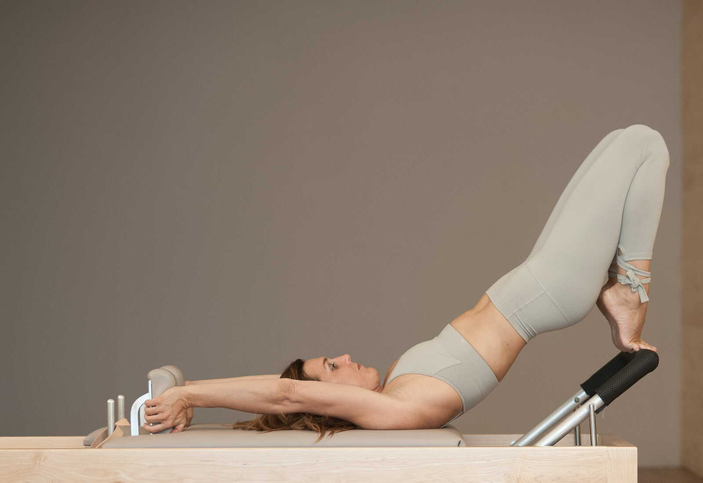

# CONTEXTE COMPLET — Refonte site Carole Vallat
> Bundle unique pour ChatGPT : tout le dossier en un fichier. Aperçus en ligne : https://barattaalexandre-collab.github.io/carole-vallat-apercu/hero-da.html (hero conforme DA) · https://barattaalexandre-collab.github.io/carole-vallat-apercu/index.html (home brouillon).

## Sommaire
1. HANDOFF (état du projet)
2. Direction Artistique V2 (le contrat visuel)
3. Wireframes (structure des pages)
4. Textes finaux des pages
5. Références — teardown studios
6. Références données par Carole
7. Source de hero-da.html (hero conforme DA)
8. Liste des captures de référence (URLs)


---

# === HANDOFF (état du projet) ===

# HANDOFF — Refonte site Carole Vallat
> Document de reprise complet. À lire en entier avant de continuer (autre chat / autre session). Date : 24/06/2026.
> Dossier maître : `~/Downloads/Refonte Site Carole Vallat/`. Mémoire persistante : `project_carole_vallat_site.md`.

---

## 0. TL;DR — où on en est
- **Tout l'amont est fait** : stratégie, benchmark, direction artistique, architecture, **textes finaux**, offres, tarifs, freebie.
- **Le build a démarré** : thème WordPress blocs sur-mesure scaffoldé, **l'accueil tourne en local et est on-brand** (testé sur WordPress Playground).
- **Reste** : décliner les autres pages dans le thème, récupérer photos + vrais témoignages, déployer sur Infomaniak.

---

## 1. Le projet
- **Cliente :** Carole Vallat — **Studio Soham**, Le Landeron (canton Neuchâtel, Suisse romande).
- **Pour :** Alexandre Baratta (studio **LPL / Les Précurseurs Lab**). **C'est le site vitrine de référence d'Alexandre** → doit être exceptionnel (génère ses futures opportunités).
- **Domaine :** `carolevallat.ch` (actuellement sous **Showit**, à quitter). `carolevalla.ch` n'existe pas.
- **Cible :** femmes 40+, péri/ménopause, Entre-deux-Lacs (Le Landeron, La Neuveville, Cressier, Neuchâtel, Bienne).

## 2. Positionnement (VALIDÉ par Carole)
**Mouvement-first**, 3 niveaux : **(1) Le mouvement** (principal) → **(2) L'accompagnement ménopause** → **(3) La réflexologie**.
- **Accueil = 2 univers** : « Le studio » (mouvement) + « L'accompagnement » (ménopause). **La réflexologie n'est PAS sur l'accueil** (page à part).
- **Ton :** incarné, **tutoiement**, simple, langage du corps & du ressenti. Pas de minceur culpabilisant, pas de jargon, pas de copier-coller des templates Menopulse.
- **Signature :** « Passe de spectatrice à actrice de ta ménopause. »
- **CTA principal :** « Je réserve mon appel offert » + « M'écrire sur WhatsApp ».

## 3. Stack technique (VERROUILLÉE)
- **WordPress — thème blocs (FSE) SUR-MESURE** (Claude code & modifie ; Carole édite le contenu visuellement).
- **Hébergement : Infomaniak** (Genève, données suisses), WordPress managé.
- **Réservation : SimplyBook.me** embarqué (cours + appel découverte + réflexo) → remplace MomoYoga.
- **Paiement : Stripe → TWINT.**
- **Rejetés (ne pas y revenir) :** Framer (GUI non pilotable par Claude), Astro (perd l'édition autonome), Lovable/SPA (SEO pourri).
- **Newsletter/freebie :** Brevo ou MailerLite (double opt-in nLPD).
- **SEO :** RankMath. **GEO/SEO via HTML rendu serveur** = avantage WordPress.

## 4. Faits & données CONFIRMÉS (tous validés)
**Offres ménopause (officiel, `05/Offres-Menopause_OFFICIEL.md`) :**
- **Programme en ligne — 200 CHF** (vidéos + cohorte 2 sem + 5 visios, **8 semaines**, visio)
- **Accompagnement 1:1 — 650 CHF** (bilan 90 min + 4×45 min, sur-mesure, **5 mois**, au studio + visio)
- **Coaching Premium — 800 CHF** (les deux combinés)
- Piliers : nutrition, compléments, stress, sommeil, mouvement, renforcement, cardio, mobilité, plancher pelvien.

**Cours (studio) + tarifs (MomoYoga) :**
- Cours : **Pilates** (groupe), **Yin Yoga**, **Pilates sur appareils** (reformer, Cadillac, Wunda Chair, Spine Corrector) en **privé/duo/trio**, **Yoga aérien**. + **Menovibe** = nouveau cours collectif rentrée (Pilates+cardio doux+renforcement, péri/ménopause, 8 max). *(dates à venir)*
- Tarifs carnets (CHF) : groupe 10×=**300** · privé/SOLO 10×=**1050** · DUO=**580** · TRIO=**450** · abos 40/12mois=1000, 20/20sem=500, 20/6mois=550, 10/10sem=275.
- Planning type : Lun 8h45/10h/12h30/17h/18h · Mar 9h/10h15/17h45 · Mer 8h20/10h35 · Jeu 17h45/19h · Ven 9h/10h.

**Réflexologie :** **1 heure · 120 CHF** · protocole chinois · **Agréée ASCA → remboursable par les complémentaires** (ASCA = OUI, à afficher).

**Bio/parcours :** ex-**designer horlogère de luxe** (15+ ans) → diplôme **Pilates Montréal 2010** → **studio fondé 2017** au Landeron (⚠️ PAS 2010) → accompagnement depuis 2015. A vécu elle-même la ménopause.

**Formations (pour À propos) :** Pilates Ann Mac Millan (2010), Personal Training (2011), Mentorat Fascia (2016) · Yin & Médecine chinoise (2016-18), BioIntegrityYoga (2021-22), Inside Flow (2023), Yoga Nidra (2023), Yoga Balle (2023), Yoga Aérien Fly Yoga (2024) · Coach Ménopause (2025), L'Ère du Souffle (2025) · Réflexologie Plantaire Chinoise (2018), Adaptive Bodywork (2019), Heart and Bones (2021) · **Agréée ASCA**.

**NAP :** Studio Soham — Carole Vallat · Ville 1, 2525 Le Landeron · +41 78 924 24 82 · info@carolevallat.ch · Instagram + Facebook.

**Freebie :** « **Ménopause Glow** » (PDF 11 p. existant, `05/Freebie_Menopause-Glow.pdf`) = lead magnet, à utiliser tel quel (palette jaune Canva à harmoniser plus tard).

## 5. Direction artistique (tokens — dans le theme.json)
- **Palette :** Ivoire `#F7F2EA` (fond) · Encre terre `#2B211A` (texte) · Terracotta `#9C5A3C` (accent/CTA) · Argile `#D4A78A` · Sauge `#5E6B4D` · Sable `#EFE7D8` · Lin `#E5DCC9` · Taupe `#7A6B5D`.
- **Typo :** **Fraunces** (titres, serif) + **Inter** (corps) — **self-hostées** (woff2 dans `assets/fonts/`, RGPD/nLPD, PAS Google CDN).
- **Style :** premium éditorial chaud, sobriété, grandes photos réelles, négatif généreux, une idée par écran, bouton radius 2px, easing `cubic-bezier(0.16,1,0.3,1)`.
- **À FUIR :** WebGL lourd, Lenis smooth-scroll, curseur custom, React/SPA, palette froide/magenta/jaune criard.
- **Réfs (vérifiées) :** The Class, Forma Pilates, JOIA (Neuchâtel), Heartcore (= WP rapide), Pvolve (positionnement). **Modèle de complétude de Carole = menostudio.fr** (coach Ménopulse, « elle veut ça + le studio en plus »). **Réf de ton = healthyrootswithlaurene.com.**

## 6. Structure des dossiers (tout est rangé ici)
```
Refonte Site Carole Vallat/
├── _HANDOFF.md  ← CE FICHIER · _LISEZ-MOI.md
├── 00 - Brief & Directives/        brief_refonte_v2.pdf
├── 01 - Strategie & Positionnement/ Carole-Vallat-Dossier-Strategique.(html|pdf)
├── 02 - Direction artistique & Contenu/
│     ├── carolevallat_direction_artistique_v2.md   (DA technique — tokens)
│     ├── Carole-Vallat_Direction-Artistique_Presentation.(html|pdf)  (DA cliente, 19 p.)
│     ├── Architecture-v2_validee-Carole.md
│     ├── Trames-de-redaction_pages.md   (structure + SEO par page)
│     ├── Textes-finaux_pages_v1.md   ← *** LES TEXTES FINAUX DES 8 PAGES ***
│     ├── carolevallat_wireframes.md
│     └── presentation-assets/  (images de la DA cliente)
├── 03 - Recherche & Benchmark/   Recherche-A/B/C (studios, tier mondial+techno, message)
├── 04 - Inspiration & Moodboard/  moodboards + Captures/ + References Alexandre/ + References-Carole_*.md
├── 05 - Contenu source Carole/
│     ├── Carole_PageAccueil_texte-COMPLET.md  (son texte d'accueil)
│     ├── Offres-Menopause_OFFICIEL.md  (200/650/800)
│     ├── Freebie_Menopause-Glow.pdf
│     ├── Comparatif-Offres-Menopause.pdf + .pages
│     └── Formation Menopulse (Drive Carole)/  (templates génériques — NE PAS copier ; légal = France inutilisable)
├── 06 - Build WordPress/
│     ├── README_build.md   ← *** SETUP COMPLET DU BUILD ***
│     ├── blueprint.json    (Playground : active le thème)
│     └── carole-vallat-theme/  ← LE THÈME
│           ├── theme.json (design system), style.css, functions.php
│           ├── templates/ (front-page.html = ACCUEIL, index.html, page.html)
│           ├── parts/ (header.html, footer.html)
│           ├── patterns/  (vide — à remplir)
│           └── assets/ (fonts/*.woff2 ✓, js/motion.js, css/editor.css)
└── 07 - Prospection & Comms/
```
**⚠️ Distinct :** le SaaS « MenoCoach / app ménopause » (`~/Downloads/meno/`, `HANDOFF-menopause-design.md`) = AUTRE projet, ne pas mélanger.

## 7. État du build
- **Thème scaffoldé et FONCTIONNEL** : `theme.json` (palette+typo+espacement), `front-page.html` (accueil complet avec les vrais textes), header/footer, motion.js.
- **Testé en local sur WordPress Playground** → accueil rend correctement, on-brand (ivoire, Fraunces, terracotta, sable, double CTA). 0 erreur PHP.
- **Polices self-hostées OK** (Fraunces + Inter dans assets/fonts/).

**Relancer le WP local (PHP-wasm, ni Docker ni PHP requis, juste Node) :**
```bash
cd "$HOME/Downloads/Refonte Site Carole Vallat/06 - Build WordPress"
npx --yes @wp-playground/cli@latest server --port=9400 \
  --mount=./carole-vallat-theme:/wordpress/wp-content/themes/carole-vallat-theme \
  --blueprint=./blueprint.json
# → http://127.0.0.1:9400  (auto-login admin ; warnings EBADF php-wasm = non bloquants)
```

## 8. CE QUI RESTE À FAIRE (ordonné)
1. **Décliner les autres pages** dans le thème (templates + patterns), à partir de `02/Textes-finaux_pages_v1.md` : Le studio · L'accompagnement (tableau 200/650/800) · Réflexologie · Ma méthode · À propos (formations) · Réserver · FAQ · Journal.
2. **Photos** : les récupérer depuis carolevallat.ch (Showit charge en CSS/JS → besoin d'inspection réseau navigateur, ou Carole fournit les fichiers). Crédit photo : « Caroline Raemi ».
3. **Polish accueil** : titre du site → « Carole Vallat » ; affiner la taille du H1 hero ; intégrer la photo hero.
4. **Plugins** : RankMath (SEO/schema), Performance Lab Image Placeholders (+AVIF, confirmer Imagick Infomaniak), Brevo/MailerLite (freebie).
5. **Intégrations** : SimplyBook (réservation), Stripe/TWINT, formulaire freebie → envoi « Ménopause Glow ».
6. **SEO** : schema LocalBusiness/Service/Person, **pages géo** (Le Landeron, La Neuveville, Cressier, Neuchâtel, Bienne), **nettoyer NAP** (domaine mort `sohombilatesyoga.com`/ville « Cornaux » → 301), optimiser GBP.
7. **Déploiement Infomaniak** + perf (cibles : Lighthouse mobile ≥95, LCP<2,5s, INP<200ms, CLS<0,1, accueil<1Mo).

## 9. En attente de Carole (mini-liste)
1. **Photos** (séance pro / de son site) · 2. **Vrais témoignages** + accord (Videoask — actuellement `[FICTIF]` dans les textes) · 3. **« Plus personnel »** de la page À propos · 4. **Dates Menovibe**.

## 10. Gotchas / corrections à NE PAS oublier
- **Studio fondé 2017** (pas 2010).
- **Prix ménopause = 200/650/800** (PAS 390/650/990 que j'avais supposés au début).
- **Menovibe** (singulier) = nom validé du cours rentrée.
- **ASCA = OUI** → afficher « remboursable ».
- **Réflexo = 1h / 120 CHF.**
- **Témoignages actuels = FICTIFS** (marqués `[FICTIF]`), à remplacer.
- Le kit « Formation Menopulse » du Drive = **templates génériques à NE PAS copier** (Google déclasse) ; ses docs **légaux = France, inutilisables** (faire du **suisse/nLPD**).
- Freebie « Ménopause Glow » = palette jaune Canva ≠ terracotta du site (harmoniser plus tard).

## 11. Comment reprendre dans le nouveau chat
1. Lire ce `_HANDOFF.md` + la mémoire `project_carole_vallat_site.md` (chargée auto).
2. Fichiers prioritaires : `02/Textes-finaux_pages_v1.md` (contenu), `06/README_build.md` (build), `06/carole-vallat-theme/` (le code).
3. Relancer le WP local (§7) pour voir l'état.
4. Continuer par : **décliner les autres pages** (§8.1).


---

# === DIRECTION ARTISTIQUE V2 ===

# Carole Vallat — Direction artistique V2
### Build-ready · supersède la v1 · intègre la revue critique (recherches A+B, stack WordPress)

> **Objectif :** un site **incarné, féminin, premium, éditorial**. Zéro template wellness générique, zéro effet « généré par IA ». Étoiles polaires (vérifiées) : **The Class** + **Forma Pilates** (serif + neutres chauds + photo de mouvement réelle + négatif), **JOIA** (architecture suisse), **The Gentlewoman / Cereal** (éditorial). Identité propre à Carole : terre, argile, terracotta, intériorité, Suisse romande.
>
> **Stack cible :** thème blocs **WordPress** (FSE) · hébergement **Infomaniak (CH)** · réservation **SimplyBook.me** embarquée · **Stripe→TWINT**. *(La v1 supposait Astro/Calendly — corrigé partout.)*

---

## 1. Principes directeurs

1. **L'espace avant la décoration** — marges généreuses, sections jamais surchargées, une idée par écran.
2. **Le mot avant l'image** — le copywriting pilote, l'image illustre. Jamais d'image « pour remplir ».
3. **Le vrai avant le joli** — uniquement des photos de Carole, dans son vrai studio. Aucune stock, aucun visuel générique.
4. **Le silence avant l'effet — mais UN moment signature autorisé.** Animations discrètes par défaut ; **un seul** moment mémorable (titre hero) toléré. Pas de parallax excessif, pas de reveal tape-à-l'œil partout.
5. **La lisibilité avant le style** — contraste suffisant, taille de texte confortable, hiérarchie claire.
6. **La vitesse fait partie du premium** — chaque effet se justifie contre le budget performance (§12). Un site lent n'est jamais premium.

---

## 2. Palette de couleurs

Terre cuite, sable suisse, argile, lin écru. Chaude, apaisante, féminine sans cliché. *(Confirmée par les captures réelles : Forma = bois/crème, The Class = taupe/sable.)*

### Principales
| Rôle | Nom | Hex | Usage |
|---|---|---|---|
| Fond principal | Ivoire chaud | `#F7F2EA` | Fond de toutes les pages (≠ blanc pur) |
| Texte principal | Encre terre | `#2B211A` | Corps, titres (≠ noir pur) |
| Accent primaire | Terracotta profond | `#9C5A3C` | CTA principaux, liens, accents H1 |
| Accent secondaire | Argile rose | `#D4A78A` | Hover, séparateurs, détails |
| Vert végétal | Sauge profonde | `#5E6B4D` | Touches nature, pilier nature, badges |

### Support
| Rôle | Nom | Hex |
|---|---|---|
| Fond alternatif | Sable clair | `#EFE7D8` |
| Bordures douces | Lin | `#E5DCC9` |
| Texte secondaire | Taupe | `#7A6B5D` |
| Succès / info | Olive douce | `#8B9065` |

**On évite :** noir pur `#000` · blanc pur `#FFF` · gradients violet/bleu (tech IA) · rose poudré générique (wellness cliché) · or/cuivre métallisé (influenceuse Instagram).

**Contrastes vérifiés (WCAG AA) :** Encre/Ivoire = 12,8:1 ✅ · Terracotta/Ivoire = 5,2:1 ✅.

---

## 3. Typographie

Combo serif éditorial expressif + sans contemporain. **Validé par les meilleurs du monde** (The Class, Pvolve, Forma = serif titres + sans corps).

- **Titres — Fraunces** (variable). H1, H2, sections, hero. Poids 300/500/700. `"opsz" 144` sur les très gros titres.
- **Corps — Inter** (variable). Paragraphes, nav, boutons, formulaires. Poids 400/500/600.
- *Alternatives premium si besoin : Editorial New / Söhne (payantes) ; Cormorant Garamond (gratuite, + classique).*

### 🔧 Règle technique critique — self-host, PAS le CDN Google Fonts
Le jugement de Munich (2022) : charger Google Fonts depuis le CDN de Google = **violation RGPD** (fuite l'IP visiteur) ; nLPD suisse alignée. Pour une praticienne **ménopause suisse** = risque légal + confiance. Donc :
- **Self-host les woff2** sur Infomaniak (même Fraunces/Inter, juste hébergées chez nous).
- **Variable fonts** (un fichier, tous poids) + **subset latin-français** (`é è ê à â ç î ô û œ ` + ponctuation) → −50 à −80 % de poids.
- **`preload`** la/les 1-2 polices du LCP uniquement.
- **`font-display: optional`** + fallback `size-adjust`/`ascent-override` pour **zéro shift** (CLS).

### Hiérarchie
```
H1 (Hero)    → Fraunces 300, 64-88px, lh 1.05, ls -0.02em
H2 (Section) → Fraunces 400, 40-56px, lh 1.15, ls -0.01em
H3 (Sub)     → Fraunces 500, 28-32px, lh 1.2
H4           → Inter 600, 20px, lh 1.3, uppercase, ls 0.08em
Corps        → Inter 400, 17-18px, lh 1.65
Petit        → Inter 400, 14px, lh 1.5
Meta/label   → Inter 500, 13px, uppercase, ls 0.1em
```
**Règles :** ligne max 65 caractères (corps) · marges verticales 96-128px desktop / 64-80px mobile · alignement à gauche uniquement · italiques pour citations/mises en valeur subtiles, pas pour décorer.

---

## 4. Direction photo *(le point le plus critique — 80 % de l'impression)*

⚠️ **Dépendance n°1 du projet :** tout repose sur de vraies photos de Carole. **À verrouiller avec elle en priorité** (sans shooting pro, le niveau visé est inatteignable).

**Ambiance :** lumière naturelle uniquement · heure dorée · tons chauds (terre/sable/lin) · grain doux léger · profondeur de champ marquée.

**Photos nécessaires :**
| # | Type | Usage | Qté |
|---|---|---|---|
| 1 | Portrait Carole, plan moyen, regard caméra, calme incarné | Hero accueil, à propos | 2-3 |
| 2 | Portrait Carole, regard ailleurs, contemplation | Hero ménopause / à propos alt | 2 |
| 3 | Carole en mouvement (yoga, pilates, pas figé) | Page mouvement, témoignages | 5-6 |
| 4 | Détails : mains, pieds, hamac, reformer, matériel | Interstitiels d'ambiance | 6-8 |
| 5 | Studio Soham vide, lumière naturelle | Localisation, page mouvement | 3-4 |
| 6 | Réflexologie (pieds, mains, setup) | Page réflexologie | 3-4 |
| 7 | Nature / campagne neuchâteloise | Transitions, page ménopause | 3-4 |

**Cadrage :** formats variés (1:1, 3:4, 16:9, 21:9) · compositions asymétriques · gestes naturels (respirer, pas poser) · espace négatif généreux.

**On évite :** stock (même belles) · poses figées catalogue · filtres Instagram saturés · fond blanc studio · mains-qui-tiennent-un-thé · pieds-dans-l'herbe-vus-d'en-haut · cœurs/mandalas/namaste.

---

## 5. Références (mood board mis à jour)

**Studios — cible chaude premium :**
1. **The Class** · theclass.com — étoile polaire : serif éditorial + mouvement réel + page « Méthode ».
2. **Forma Pilates** · formapilates.co — la palette earthy (bois/crème/terracotta) + retenue + négatif.
3. **JOIA** · joia-studio.com — réf n°1, même canton : géo-SEO + booking bSport + hero une-phrase.
4. **Heartcore** · weareheartcore.com — preuve que premium = WordPress rapide (Kinsta low-carbon).
5. **Pvolve** · pvolve.com — positionnement ménopause/étapes-de-vie + quiz. *(visuel sombre/promo : NE PAS copier.)*
6. **Forme** · forme.fitness — géo en H1 + page « Qu'est-ce que… ».

**Éditorial / typo :** The Gentlewoman, Cereal, Kinfolk, Sunday Forever.
**Photo (mood seulement) :** Yoann « Melo » Guerini *(photographe, PAS un studio)*, Sarah Moon, Dirk Braeckman, Vilhelm Hammershøi.
**Matières :** céramiques suisses (argile/grès/raku), lin froissé, coton bio.

---

## 6. Composants UI

**Boutons**
- *Primaire :* fond Terracotta `#9C5A3C`, texte Ivoire, Inter 500 16px ls 0.02em, padding `18px 32px`, radius `2px`, hover −8 % + shift −1px, transition 300ms `var(--ease-out-expo)`.
- *Secondaire :* lien souligné, underline 1px offset 4px, hover underline Terracotta.
- *Tertiaire (ghost) :* bordure 1px Encre, fond transparent, hover fond Sable.

**Cards :** fond Sable `#EFE7D8`, radius `4px`, padding `40px`, shadow nulle (ou `0 1px 2px rgba(43,33,26,.04)`), hover shift −2px + bordure Terracotta 1px optionnelle.

**Séparateurs :** filet 1px Lin · ou `*`/`•` centré · ou simplement l'espace + changement de fond.

**Formulaires :** input fond Ivoire, bordure basse 1px Taupe, label Inter 500 13px uppercase au-dessus (fixe, pas flottant) ; focus bordure basse Terracotta 2px ; erreur rouge brique `#A04545`.

**Navigation :** desktop = logo gauche, liens centre, CTA « Réserver » (primaire) droite ; sticky fond Ivoire translucide + backdrop-blur 8px ; active = underline fin ; mobile = hamburger, ouverture en fade.

---

## 7. Layout & grille

- **12 colonnes** desktop, gutter `24px` · container max `1280px` · marges latérales `32px` desktop / `20px` mobile.
- **Texte long** contraint à max-width `680px`.
- **Breakpoints :** Mobile 0-639 · Tablet 640-1023 · Desktop 1024-1439 · Large 1440+.
- **Rythme vertical :** hero `min-height: 92vh` · sections 128px desktop / 80px mobile · entre éléments 48/32px · entre paragraphes 24px.

---

## 8. Animations & micro-interactions *(upgradé)*

**Règle d'or :** si une animation n'apporte pas clarté ou émotion juste, on l'enlève. Construire d'abord le chemin **reduced-motion**, superposer le motion en enhancement.

### Easing (token unique)
`--ease-out-expo: cubic-bezier(0.16, 1, 0.3, 1)` — réutilisé partout, ~400-700ms. **Plus grand levier de qualité perçue, coût nul.**

### Adopté (quasi gratuit, SEO-safe)
- **Fade-in + translate-up** (opacité 0→1, +16px) à l'apparition.
- **Reveals CSS scroll-driven** (`animation-timeline: view()`) — hors main thread, **sans JS**, derrière `@supports`, fallback statique. *(Préféré à Motion One pour les reveals.)*
- **View Transitions cross-document** (`@view-transition { navigation: auto }` + `view-transition-name` sur hero/logo) — **effet SPA sur WordPress PHP**, ≤300ms, dégrade proprement.
- **Hover bouton** (couleur 300ms) · **hover image** (zoom 1.02x en 800ms) · **nav sticky** en fade.
- **1 CTA magnétique** sur le bouton de conversion principal (~30 lignes vanilla JS, off tactile + reduced-motion).

### Le moment signature (UN seul)
**Titre hero homepage en GSAP SplitText** (révélation ligne/mot), `defer`, homepage uniquement, reduced-motion gated, ~50 Ko sur 1 page. GSAP est **gratuit depuis avril 2025**. *Un moment, pas dix.*

### Refusé (la v1 avait raison — confirmé par la recherche)
❌ WebGL / Three.js / R3F / Spline ❌ Lenis / smooth-scroll global *(menace l'INP + hostile vestibulaire = mauvais pour audience ménopause)* ❌ curseur custom ❌ scroll-snap / scroll-jacking ❌ vidéo background lourde en hero ❌ front React / Framer Motion.

---

## 9. Accessibilité *(renforcé)*

- **Contraste AA** sur tout texte (4.5:1) — vérifié §2.
- **Taille corps min 16px.**
- **`prefers-reduced-motion`** = interrupteur maître autour de **chaque** animation. **Doublement critique** : audience ménopause/plus âgée = sensibilité vestibulaire fréquente. Ici, l'a11y EST une part du premium (et l'EAA EU 2025 augmente l'exposition légale).
- **`:focus-visible`** ring Terracotta 2px offset · navigation clavier complète · skip-link · ne pas laisser le JS avaler ancres/tab.
- **Alt text** utile sur toute image informative, `alt=""` sur décoratif · un seul H1/page · pas de niveaux sautés.

---

## 10. Système d'icônes

**Lucide** (1.5px stroke, fin, gratuit, open source) en SVG inline. Taille défaut 20px, couleur héritée. Pour social, flèches, check, téléphone, email, localisation. Pas d'emoji, pas de bitmap.

---

## 11. 🆕 Pipeline image *(absent de la v1)*

- **AVIF/WebP** — WP core 6.5+ génère l'AVIF nativement *si Imagick/GD le supporte* (→ **1 email à Infomaniak pour confirmer**). Sinon WebP.
- **`srcset`/`sizes` responsive** — WP core automatique, ne pas réinventer.
- **Placeholder couleur dominante** — plugin **Performance Lab « Image Placeholders »** → tue le flash blanc, **prévient le CLS**, coût client ~0.
- **Hero : `fetchpriority="high"` et PAS lazy** *(erreur WordPress classique qui détruit le LCP)*. Tout le reste : `loading="lazy"`.
- `width`/`height` (ou `aspect-ratio`) sur **tout** média → zéro CLS.

---

## 12. 🆕 Budget performance *(absent de la v1 — c'est l'argument de vente)*

Cibles défendables (75e percentile, mobile) :
| Métrique | Cible |
|---|---|
| Lighthouse Performance (mobile) | **≥ 95** · A11y/SEO/Best-practices **100** |
| LCP (chargement) | **≤ 2,5 s** |
| INP (réactivité) | **≤ 200 ms** |
| CLS (stabilité) | **< 0,1** |
| Poids page d'accueil | **< 1 Mo** |

Leviers WP : CSS critique inline · GSAP/JS `defer` seulement où utilisé · cache page Infomaniak · mesurer en RUM (`web-vitals`/CrUX), pas que Lighthouse.

---

## 13. Favicon & meta-images *(corrigé : WordPress, pas Astro)*

- **Favicon :** monogramme « CV » en Fraunces, Terracotta sur Ivoire. SVG + PNG 32, 180 (apple-touch), 512.
- **Open Graph :** 1 image OG/page (1200×630), titre Fraunces sur fond photo + logo discret. Génération via **plugin SEO WordPress (RankMath)** ou images statiques par page. *(Plus de `@vercel/og` — on n'est pas sur Astro.)*

---

## 14. 🆕 Templates de page ROI *(venus de la recherche)*

À intégrer aux wireframes :
- **Template « Méthode / Qu'est-ce que… »** — pattern The Class/Forme/Heartcore (« Our Method »). Forte valeur GEO/SEO + réassurance. Décliner pour **réflexologie** ET **ménopause**.
- **Template « page locale géo-indexée »** — move ROI n°1 (JOIA, Embody) : 1 page par service+localité, titres géo-riches humains (« Pilates à Le Landeron », « Réflexologie Neuchâtel », « Ménopause Suisse romande »).
- **Barre de confiance** — version solo de la barre presse (Forma) : « Agréée ASCA · remboursable », avis Google, « depuis 2010 / 15+ ans ».
- **Mini-quiz d'orientation** (Pvolve) — « Par où commencer ? » route vers la bonne porte + capte un lead. WP léger, sans SPA.

---

## 15. Ce que ça donne, in fine

Provoquer chez la visiteuse, dans les 5 premières secondes :
1. **« C'est beau. »** — qualité photo, vide, typographie.
2. **« C'est pour moi. »** — le copywriting qui la reconnaît.
3. **« Cette personne est sérieuse. »** — cohérence, sobriété, clarté, vitesse.

Pas de wow-effect tape-à-l'œil. Une tenue, une écriture, une respiration — et un seul moment de grâce.

---

## ✅ À valider avec Carole
- [ ] Palette (présenter 2-3 mockups avant de figer)
- [ ] Polices (lui montrer des exemples)
- [ ] **Matériel photo §4 — le bloquant n°1** (peut-elle fournir / faut-il un shooting ?)
- [ ] Références §5 qui lui parlent le plus
- [ ] Ton des animations (calme, un seul moment)
- [ ] Confirmer Imagick AVIF chez Infomaniak (email)
- [ ] Liste exacte formations/certifications + agrément ASCA (E-E-A-T)

---
*v2 — supersède `carolevallat_direction_artistique.md` (v1). Voir `Revue-Critique_Direction-Artistique.md` pour le détail des changements.*


---

# === WIREFRAMES ===

# Carole Vallat — Wireframes basse fidélité

> Document de travail. Structure visuelle des 6 pages, bloc par bloc. Les textes renvoient au document `carolevallat_textes_v1.md`. Le style visuel est défini dans `carolevallat_direction_artistique.md`. Ces wireframes servent à valider la structure AVANT le design haute fidélité.

---

## 🧭 Header global (toutes pages)

```
┌─────────────────────────────────────────────────────────────────┐
│                                                                 │
│  CAROLE VALLAT    Mouvement  Réflexologie  Ménopause  À propos  │
│                                                      [Réserver] │
│                                                                 │
└─────────────────────────────────────────────────────────────────┘
```

- **Hauteur** : 80px desktop, 64px mobile
- **Logo / nom** : à gauche, en Fraunces 500 20px, couleur Encre terre
- **Nav centrale** : 4 liens principaux, Inter 500 15px
- **CTA "Réserver"** : bouton Terracotta à droite
- **Sticky** : oui, avec backdrop-blur subtil au scroll
- **Mobile** : hamburger à droite, logo centré

---

## 🦶 Footer global (toutes pages)

```
┌─────────────────────────────────────────────────────────────────┐
│                                                                 │
│  CAROLE VALLAT            NAVIGATION           CONTACT          │
│  Enseignante, coach       Accueil              Studio Soham     │
│  & réflexologue           Mouvement            [Adresse]        │
│  au Landeron              Réflexologie         +41 78 924 24 82 │
│                           Ménopause            info@carole…     │
│  [Instagram] [Facebook]   À propos                              │
│                           Réserver             NEWSLETTER       │
│                                                 [Email input]   │
│                                                 [S'inscrire]    │
│                                                                 │
│  ─────────────────────────────────────────────────────────────  │
│                                                                 │
│  © 2026 Carole Vallat     Mentions légales   Confidentialité   │
│                                                                 │
└─────────────────────────────────────────────────────────────────┘
```

- **4 colonnes** desktop, empilées en mobile
- **Fond** : Sable clair `#EFE7D8`
- **Padding** : 96px vertical desktop, 64px mobile
- **Séparateur bas** : filet Lin `#E5DCC9`

---

## 🏠 1. Page d'accueil — `/`

### Structure en 9 sections

```
┌─────────────────────────────────────────────────────────────────┐
│ [HEADER GLOBAL]                                                 │
├─────────────────────────────────────────────────────────────────┤
│                                                                 │
│  SECTION 1 — HERO                              min-height: 92vh │
│                                                                 │
│  ┌───────────────────────┐  ┌─────────────────────────────┐    │
│  │                       │  │                             │    │
│  │  H1 Retrouve un       │  │                             │    │
│  │  corps plus fort,     │  │    [PHOTO CAROLE           │    │
│  │  plus mobile et       │  │     plan moyen,             │    │
│  │  plus serein.         │  │     regard caméra,          │    │
│  │                       │  │     portrait 3:4]           │    │
│  │  Sous-titre 1-2 lignes│  │                             │    │
│  │                       │  │                             │    │
│  │  [CTA primaire] ↓     │  │                             │    │
│  │  [CTA secondaire]     │  │                             │    │
│  │                       │  │                             │    │
│  └───────────────────────┘  └─────────────────────────────┘    │
│                                                                 │
├─────────────────────────────────────────────────────────────────┤
│                                                                 │
│  SECTION 2 — RECONNAISSANCE                         fond Sable  │
│                                                                 │
│           "Peut-être que tu te reconnais ici…"                  │
│                                                                 │
│       Texte centré, max-width 680px, Fraunces 500 28px          │
│       Tu as l'impression que ton corps n'est plus...            │
│       [4-5 phrases d'accroche]                                  │
│                                                                 │
│                Tu n'es pas seule.                               │
│               Et tu n'as pas à subir.                           │
│                                                                 │
├─────────────────────────────────────────────────────────────────┤
│                                                                 │
│  SECTION 3 — TROIS PORTES D'ENTRÉE                  fond Ivoire │
│                                                                 │
│           Trois manières de revenir à toi                       │
│                                                                 │
│  ┌───────────────┐  ┌───────────────┐  ┌───────────────┐       │
│  │               │  │               │  │               │       │
│  │ [Photo 1:1]   │  │ [Photo 1:1]   │  │ [Photo 1:1]   │       │
│  │               │  │               │  │               │       │
│  │ Le mouvement  │  │ Réflexologie  │  │ Ménopause     │       │
│  │               │  │               │  │               │       │
│  │ Yoga, Pilates,│  │ Un soin pour  │  │ À partir de   │       │
│  │ Yin et aérien │  │ ralentir...   │  │ 40 ans...     │       │
│  │               │  │               │  │               │       │
│  │ Découvrir →   │  │ Découvrir →   │  │ Découvrir →   │       │
│  │               │  │               │  │               │       │
│  └───────────────┘  └───────────────┘  └───────────────┘       │
│                                                                 │
├─────────────────────────────────────────────────────────────────┤
│                                                                 │
│  SECTION 4 — MON APPROCHE                           fond Sable  │
│                                                                 │
│  ┌─────────────────────────┐  ┌──────────────────────────┐     │
│  │                         │  │                          │     │
│  │ H2 Une approche qui     │  │  [Photo détail           │     │
│  │ relie tout ce qui te    │  │   mains/geste/matière]   │     │
│  │ compose                 │  │                          │     │
│  │                         │  │                          │     │
│  │ Texte (3 paragraphes)   │  │                          │     │
│  │ Depuis plus de dix ans… │  │                          │     │
│  │                         │  │                          │     │
│  │ Citation mise en avant  │  │                          │     │
│  │ "Le but n'est pas de    │  │                          │     │
│  │ faire plus. C'est de    │  │                          │     │
│  │ faire plus juste."      │  │                          │     │
│  │                         │  │                          │     │
│  └─────────────────────────┘  └──────────────────────────┘     │
│                                                                 │
├─────────────────────────────────────────────────────────────────┤
│                                                                 │
│  SECTION 5 — LES 5 PILIERS                          fond Ivoire │
│                                                                 │
│           H2 Les 5 piliers que je travaille avec toi            │
│                                                                 │
│  ┌──────┐ ┌──────┐ ┌──────┐ ┌──────┐ ┌──────┐                  │
│  │ 01   │ │ 02   │ │ 03   │ │ 04   │ │ 05   │                  │
│  │      │ │      │ │      │ │      │ │      │                  │
│  │Muscl.│ │Cardio│ │Mental│ │Fascia│ │Nourr.│                  │
│  │& os  │ │      │ │      │ │      │ │      │                  │
│  │      │ │      │ │      │ │      │ │      │                  │
│  │Texte │ │Texte │ │Texte │ │Texte │ │Texte │                  │
│  └──────┘ └──────┘ └──────┘ └──────┘ └──────┘                  │
│                                                                 │
│  → Mobile: scroll horizontal snap ou empilement vertical        │
│                                                                 │
├─────────────────────────────────────────────────────────────────┤
│                                                                 │
│  SECTION 6 — TÉMOIGNAGES                            fond Sable  │
│                                                                 │
│         Ce que vivent les femmes que j'accompagne               │
│                                                                 │
│  ┌─────────────────────────────────────────────────────┐       │
│  │  "Studio Soham est pour moi un lieu exceptionnel    │       │
│  │  que je fréquente depuis 5 ans. Carole est une      │       │
│  │  professeure incroyable..."                         │       │
│  │                                                     │       │
│  │  [Photo ronde]  — Prénom, Le Landeron               │       │
│  └─────────────────────────────────────────────────────┘       │
│                                                                 │
│         ● ○ ○    (indicateurs de slider/carousel)               │
│                                                                 │
├─────────────────────────────────────────────────────────────────┤
│                                                                 │
│  SECTION 7 — LOCALISATION                           fond Ivoire │
│                                                                 │
│  ┌──────────────────────────┐  ┌────────────────────────┐      │
│  │                          │  │                        │      │
│  │ H2 Au Studio Soham,      │  │  [Photo studio vide    │      │
│  │ au Landeron              │  │   lumière naturelle]   │      │
│  │                          │  │                        │      │
│  │ Texte + infos pratiques  │  │                        │      │
│  │ 📍 [Adresse]             │  │                        │      │
│  │ 📞 +41 78 924 24 82      │  │                        │      │
│  │ ✉️  info@carolevallat.ch  │  │                        │      │
│  │                          │  │                        │      │
│  │ → Voir le plan           │  │                        │      │
│  │                          │  │                        │      │
│  └──────────────────────────┘  └────────────────────────┘      │
│                                                                 │
├─────────────────────────────────────────────────────────────────┤
│                                                                 │
│  SECTION 8 — CTA FINAL                         fond Terracotta  │
│                                                                 │
│             H2 Un premier pas, à ton rythme.                    │
│             (couleur Ivoire sur fond Terracotta)                │
│                                                                 │
│              Texte court en 2 lignes                            │
│                                                                 │
│   [Réserver cours]  [Réflexologie]  [Appel ménopause]           │
│     (ghost Ivoire)  (ghost Ivoire)  (ghost Ivoire)              │
│                                                                 │
├─────────────────────────────────────────────────────────────────┤
│ [FOOTER GLOBAL]                                                 │
└─────────────────────────────────────────────────────────────────┘
```

**Notes desktop** : hero asymétrique (texte 55% / photo 45%). Cards portes d'entrée en grille 3 colonnes. Section approche inversée (image à droite).

**Notes mobile** : tout empilé, hero photo au-dessus ou en background atténué, cards portes d'entrée empilées.

---

## 🧘 2. Page Mouvement — `/mouvement/`

```
┌─────────────────────────────────────────────────────────────────┐
│ [HEADER GLOBAL]                                                 │
├─────────────────────────────────────────────────────────────────┤
│                                                                 │
│  HERO                                           min-height: 80vh│
│                                                                 │
│  ┌─────────────────────────┐  ┌────────────────────────┐       │
│  │                         │  │                        │       │
│  │ H1 Le mouvement pour    │  │                        │       │
│  │ une vie qui te          │  │ [Photo Carole en       │       │
│  │ ressemble.              │  │  mouvement, dynamique, │       │
│  │                         │  │  lumière studio]       │       │
│  │ Sous-titre              │  │                        │       │
│  │                         │  │                        │       │
│  │ [Réserver cours d'essai]│  │                        │       │
│  │                         │  │                        │       │
│  └─────────────────────────┘  └────────────────────────┘       │
│                                                                 │
├─────────────────────────────────────────────────────────────────┤
│                                                                 │
│  SECTION POUR QUI                                   fond Sable  │
│                                                                 │
│    H2 Tu veux retrouver un corps capable dans ta vraie vie      │
│                                                                 │
│    Texte avec "Tu veux…" en liste mise en avant                 │
│    (max-width 680px, centré)                                    │
│                                                                 │
├─────────────────────────────────────────────────────────────────┤
│                                                                 │
│  SECTION DISCIPLINES                                fond Ivoire │
│                                                                 │
│                       H2 Mes cours                              │
│                                                                 │
│  Alternance texte/image inversée par bloc :                     │
│                                                                 │
│  ┌─────────────────┐  ┌──────────────────────┐                 │
│  │                 │  │ 01 — Pilates         │                 │
│  │ [Photo Pilates] │  │                      │                 │
│  │                 │  │ Une approche fluide  │                 │
│  │                 │  │ et fonctionnelle...  │                 │
│  │                 │  │                      │                 │
│  │                 │  │ Pour qui : ...       │                 │
│  └─────────────────┘  └──────────────────────┘                 │
│                                                                 │
│  ┌──────────────────────┐  ┌─────────────────┐                 │
│  │ 02 — Pilates Reformer│  │ [Photo Reformer]│                 │
│  │                      │  │                 │                 │
│  │ Texte...             │  │                 │                 │
│  │                      │  │                 │                 │
│  └──────────────────────┘  └─────────────────┘                 │
│                                                                 │
│  [Même pattern pour Yin, Yoga Fascias, Inside Flow,             │
│   Yoga Nidra, Yoga aérien]                                      │
│                                                                 │
├─────────────────────────────────────────────────────────────────┤
│                                                                 │
│  SECTION APPROCHE                                   fond Sable  │
│                                                                 │
│          H2 Une approche qui te respecte                        │
│                                                                 │
│       Texte centré max-width 680px, 2 paragraphes               │
│                                                                 │
├─────────────────────────────────────────────────────────────────┤
│                                                                 │
│  SECTION STUDIO SOHAM                          fond Ivoire      │
│                                                                 │
│  [Grille 3 photos du studio en format varié]                    │
│                                                                 │
│  ┌──────────┐ ┌──────┐                                          │
│  │          │ │      │                                          │
│  │          │ │      │                                          │
│  │  Grande  │ ├──────┤   H2 Le Studio Soham, au Landeron        │
│  │          │ │      │                                          │
│  │          │ │ Petite                                          │
│  └──────────┘ └──────┘   Texte (4-5 lignes)                     │
│                                                                 │
├─────────────────────────────────────────────────────────────────┤
│                                                                 │
│  SECTION HORAIRES & TARIFS                          fond Sable  │
│                                                                 │
│           H2 Horaires & tarifs                                  │
│                                                                 │
│         Texte court explicatif                                  │
│                                                                 │
│  [Voir horaires] [Voir tarifs] [Réserver cours d'essai]         │
│                                                                 │
├─────────────────────────────────────────────────────────────────┤
│                                                                 │
│  CTA FINAL                                     fond Terracotta  │
│                                                                 │
│           H2 Et si tu venais essayer ?                          │
│           Texte 2 lignes                                        │
│           [Réserver mon cours d'essai]                          │
│                                                                 │
├─────────────────────────────────────────────────────────────────┤
│ [FOOTER GLOBAL]                                                 │
└─────────────────────────────────────────────────────────────────┘
```

---

## 🦶 3. Page Réflexologie — `/reflexologie-plantaire/`

```
┌─────────────────────────────────────────────────────────────────┐
│ [HEADER GLOBAL]                                                 │
├─────────────────────────────────────────────────────────────────┤
│                                                                 │
│  HERO                                           min-height: 80vh│
│                                                                 │
│  Layout centré (différent des autres pages pour créer calme)    │
│                                                                 │
│                [Photo détail mains/pieds]                       │
│                    (format paysage)                             │
│                                                                 │
│        H1 Un soin pour ralentir, relâcher, rééquilibrer.        │
│                                                                 │
│                    Sous-titre 2 lignes                          │
│                                                                 │
│                  [Prendre rendez-vous]                          │
│                                                                 │
├─────────────────────────────────────────────────────────────────┤
│                                                                 │
│  SECTION POUR QUI                                   fond Sable  │
│                                                                 │
│             H2 Ce soin est pour toi si…                         │
│                                                                 │
│    • Tu te sens stressée, tendue ou en surcharge.               │
│    • Tu dors moins bien ou tu récupères difficilement.          │
│    • Tu traverses une période de transition hormonale...        │
│    • Tu veux un moment de soin qui fasse du bien...             │
│    • Tu cherches une vraie pause, pas seulement un massage.     │
│                                                                 │
│    (liste alignée à gauche, max-width 680px, centré)            │
│                                                                 │
├─────────────────────────────────────────────────────────────────┤
│                                                                 │
│  SECTION COMMENT ÇA MARCHE                          fond Ivoire │
│                                                                 │
│  ┌────────────────────────┐  ┌────────────────────────┐         │
│  │                        │  │                        │         │
│  │  [Photo détail         │  │ H2 Ce que la           │         │
│  │   séance, setup        │  │ réflexologie peut      │         │
│  │   apaisant]            │  │ t'apporter             │         │
│  │                        │  │                        │         │
│  │                        │  │ Texte 2 paragraphes    │         │
│  │                        │  │                        │         │
│  └────────────────────────┘  └────────────────────────┘         │
│                                                                 │
├─────────────────────────────────────────────────────────────────┤
│                                                                 │
│  SECTION UNE SÉANCE                                 fond Sable  │
│                                                                 │
│             H2 Comment se déroule une séance                    │
│                                                                 │
│          Texte déroulé en 3-4 phrases                           │
│                                                                 │
│  ┌────────────┐  ┌────────────┐  ┌────────────┐                │
│  │  Durée     │  │   Tarif    │  │    Lieu    │                │
│  │   1h       │  │   [CHF]    │  │Studio Soham│                │
│  └────────────┘  └────────────┘  └────────────┘                │
│                                                                 │
├─────────────────────────────────────────────────────────────────┤
│                                                                 │
│  SECTION FAQ                                        fond Ivoire │
│                                                                 │
│          H2 Les questions qu'on me pose souvent                 │
│                                                                 │
│  ▸ Est-ce que c'est douloureux ?                                │
│  ▸ Combien de séances faut-il ?                                 │
│  ▸ Est-ce remboursé par les assurances ?                        │
│  ▸ Est-ce compatible avec un suivi médical ?                    │
│                                                                 │
│  (Accordéons natifs <details> HTML, max-width 720px)            │
│                                                                 │
├─────────────────────────────────────────────────────────────────┤
│                                                                 │
│  CTA FINAL                                     fond Terracotta  │
│                                                                 │
│               H2 Réserver ton soin                              │
│               Texte 2 lignes                                    │
│               [Prendre rendez-vous]                             │
│                                                                 │
├─────────────────────────────────────────────────────────────────┤
│ [FOOTER GLOBAL]                                                 │
└─────────────────────────────────────────────────────────────────┘
```

---

## 🌿 4. Page Ménopause — `/menopause/`

```
┌─────────────────────────────────────────────────────────────────┐
│ [HEADER GLOBAL]                                                 │
├─────────────────────────────────────────────────────────────────┤
│                                                                 │
│  HERO                                           min-height: 92vh│
│                                                                 │
│  ┌────────────────────────┐  ┌─────────────────────────┐       │
│  │                        │  │                         │       │
│  │ H1 Tu n'as pas à       │  │                         │       │
│  │ subir. Il existe des   │  │  [Photo Carole          │       │
│  │ solutions.             │  │   regard direct,        │       │
│  │                        │  │   posture incarnée,     │       │
│  │ Sous-titre             │  │   portrait 3:4]         │       │
│  │                        │  │                         │       │
│  │ [Découvrir programme]  │  │                         │       │
│  │ [Appel découverte]     │  │                         │       │
│  │                        │  │                         │       │
│  └────────────────────────┘  └─────────────────────────┘       │
│                                                                 │
├─────────────────────────────────────────────────────────────────┤
│                                                                 │
│  SECTION LE PROBLÈME                                fond Sable  │
│                                                                 │
│           H2 Tu te reconnais peut-être ici…                     │
│                                                                 │
│          Texte en phrases courtes, centré, espacé               │
│                                                                 │
│              Tu ne reconnais plus ton corps.                    │
│           Ce qui marchait avant ne marche plus pareil.          │
│            Tu manques d'énergie, de tonus, de clarté.           │
│                      [etc.]                                     │
│                                                                 │
├─────────────────────────────────────────────────────────────────┤
│                                                                 │
│  SECTION MESSAGE CLÉ                        fond Terracotta     │
│                                                                 │
│    Bloc pleine largeur, texte Ivoire grand, centré              │
│                                                                 │
│                Ton corps n'est pas cassé.                       │
│             Il a changé de physiologie.                         │
│     Le but n'est pas de faire plus. C'est de faire plus juste.  │
│                                                                 │
│    (Fraunces 300, 40-48px, line-height 1.3, max-width 900px)    │
│                                                                 │
├─────────────────────────────────────────────────────────────────┤
│                                                                 │
│  SECTION MÉTHODE — 5 PILIERS                        fond Ivoire │
│                                                                 │
│    H2 Ma méthode : les 5 piliers de la femme à partir de 40 ans │
│                                                                 │
│              Intro courte (2-3 lignes)                          │
│                                                                 │
│  ┌─────────────────────────────────────────────────────┐       │
│  │ 01  Muscles & os                                    │       │
│  │     À partir de 40 ans, tu perds en masse...        │       │
│  └─────────────────────────────────────────────────────┘       │
│                                                                 │
│  ┌─────────────────────────────────────────────────────┐       │
│  │ 02  Cardio                                          │       │
│  │     Le système cardio-vasculaire change...          │       │
│  └─────────────────────────────────────────────────────┘       │
│                                                                 │
│  [3 autres blocs empilés verticalement]                         │
│                                                                 │
├─────────────────────────────────────────────────────────────────┤
│                                                                 │
│  SECTION DEUX CHEMINS                               fond Sable  │
│                                                                 │
│            H2 Deux manières d'être accompagnée                  │
│                                                                 │
│  ┌────────────────────────┐  ┌────────────────────────┐         │
│  │                        │  │                        │         │
│  │  [Icône ou visuel]     │  │  [Icône ou visuel]     │         │
│  │                        │  │                        │         │
│  │  Programme en ligne    │  │  Coaching privé        │         │
│  │                        │  │                        │         │
│  │  Texte description     │  │  Texte description     │         │
│  │                        │  │                        │         │
│  │  BADGE: En préparation │  │                        │         │
│  │                        │  │                        │         │
│  │  [Liste d'attente]     │  │  [Appel découverte]    │         │
│  │                        │  │                        │         │
│  └────────────────────────┘  └────────────────────────┘         │
│                                                                 │
├─────────────────────────────────────────────────────────────────┤
│                                                                 │
│  SECTION POURQUOI MOI                               fond Ivoire │
│                                                                 │
│  ┌────────────────────────┐  ┌────────────────────────┐         │
│  │                        │  │                        │         │
│  │  [Photo Carole         │  │  H2 Pourquoi me        │         │
│  │   portrait contempla-  │  │  faire confiance       │         │
│  │   tif]                 │  │                        │         │
│  │                        │  │  Texte bio 2 paragraphes│        │
│  │                        │  │                        │         │
│  │                        │  │  → Mon parcours        │         │
│  └────────────────────────┘  └────────────────────────┘         │
│                                                                 │
├─────────────────────────────────────────────────────────────────┤
│                                                                 │
│  SECTION FAQ                                        fond Sable  │
│                                                                 │
│           H2 Questions fréquentes                               │
│                                                                 │
│  ▸ À partir de quel âge ce programme me concerne ?              │
│  ▸ Est-ce que je dois déjà être sportive ?                      │
│  ▸ Combien de temps dure le programme ?                         │
│  ▸ Est-ce que tu remplaces un suivi médical ?                   │
│  ▸ Et si je veux juste un avis avant de m'engager ?             │
│                                                                 │
├─────────────────────────────────────────────────────────────────┤
│                                                                 │
│  CTA FINAL                                     fond Terracotta  │
│                                                                 │
│   H2 Le moment de reprendre la main, c'est maintenant.          │
│                                                                 │
│   [Liste d'attente programme]  [Appel découverte]               │
│                                                                 │
├─────────────────────────────────────────────────────────────────┤
│ [FOOTER GLOBAL]                                                 │
└─────────────────────────────────────────────────────────────────┘
```

---

## 👋 5. Page À propos — `/a-propos/`

```
┌─────────────────────────────────────────────────────────────────┐
│ [HEADER GLOBAL]                                                 │
├─────────────────────────────────────────────────────────────────┤
│                                                                 │
│  HERO                                           min-height: 85vh│
│                                                                 │
│  Layout : grande photo portrait 60% + texte 40%                 │
│                                                                 │
│  ┌──────────────────────────────┐  ┌──────────────────┐        │
│  │                              │  │                  │        │
│  │                              │  │ H1 Bonjour,      │        │
│  │                              │  │ je suis Carole.  │        │
│  │   [GRANDE PHOTO              │  │                  │        │
│  │    PORTRAIT CAROLE           │  │ Sous-titre       │        │
│  │    expression calme          │  │ 2 lignes         │        │
│  │    lumière douce]            │  │                  │        │
│  │                              │  │                  │        │
│  │                              │  │                  │        │
│  └──────────────────────────────┘  └──────────────────┘        │
│                                                                 │
├─────────────────────────────────────────────────────────────────┤
│                                                                 │
│  SECTION MON HISTOIRE                               fond Sable  │
│                                                                 │
│                 H2 Mon parcours                                 │
│                                                                 │
│  Texte long, max-width 680px, centré                            │
│  Fraunces 400 20px pour les intertitres, Inter 18px corps       │
│                                                                 │
│  J'ai commencé la gymnastique à cinq ans. Très vite...          │
│                                                                 │
│  Je me suis ensuite formée au Pilates, au yoga...               │
│                                                                 │
│  Aujourd'hui, je tisse tout ça ensemble...                      │
│                                                                 │
├─────────────────────────────────────────────────────────────────┤
│                                                                 │
│  SECTION PHILOSOPHIE                                fond Ivoire │
│                                                                 │
│  ┌──────────────────────┐  ┌───────────────────────────┐       │
│  │                      │  │                           │       │
│  │                      │  │ H2 Ce que je crois        │       │
│  │  [Photo détail       │  │                           │       │
│  │   main, geste,       │  │ 3 paragraphes             │       │
│  │   matière]           │  │                           │       │
│  │                      │  │                           │       │
│  └──────────────────────┘  └───────────────────────────┘       │
│                                                                 │
├─────────────────────────────────────────────────────────────────┤
│                                                                 │
│  SECTION FORMATIONS                                 fond Sable  │
│                                                                 │
│           H2 Mes formations & certifications                    │
│                                                                 │
│  Layout en 2 colonnes, liste propre                             │
│                                                                 │
│  • Pilates Mat & Reformer    • Yoga Nidra                       │
│  • Inside Flow Yoga          • Yoga aérien                      │
│  • BiointegrityYoga          • Réflexologie plantaire           │
│  • Yin Yoga                  • Formation ménopause              │
│                                                                 │
│  (Chaque ligne : titre + école + année en Taupe plus petit)     │
│                                                                 │
├─────────────────────────────────────────────────────────────────┤
│                                                                 │
│  SECTION PLUS PERSONNEL                             fond Ivoire │
│                                                                 │
│           H2 Ce que je préfère, en dehors du studio             │
│                                                                 │
│     Texte personnel de Carole, max-width 680px                  │
│                                                                 │
│     Photos en mosaïque plus lifestyle (3-4 images)              │
│                                                                 │
├─────────────────────────────────────────────────────────────────┤
│                                                                 │
│  CTA FINAL                                     fond Terracotta  │
│                                                                 │
│    Texte "Si ce que tu as lu ici te parle..."                   │
│                                                                 │
│   [Découvrir cours]  [Réflexologie]  [Appel découverte]         │
│                                                                 │
├─────────────────────────────────────────────────────────────────┤
│ [FOOTER GLOBAL]                                                 │
└─────────────────────────────────────────────────────────────────┘
```

---

## 📅 6. Page Réserver — `/reserver/`

```
┌─────────────────────────────────────────────────────────────────┐
│ [HEADER GLOBAL]                                                 │
├─────────────────────────────────────────────────────────────────┤
│                                                                 │
│  HERO COMPACT                                   min-height: 50vh│
│                                                                 │
│                 H1 Réserver ta séance                           │
│                                                                 │
│           Sous-titre court, 2 lignes, centré                    │
│                                                                 │
├─────────────────────────────────────────────────────────────────┤
│                                                                 │
│  SECTION 3 CARDS DE RÉSERVATION                     fond Sable  │
│                                                                 │
│  ┌───────────────┐  ┌───────────────┐  ┌───────────────┐       │
│  │               │  │               │  │               │       │
│  │ [Icône cours] │  │ [Icône soin]  │  │ [Icône ménop] │       │
│  │               │  │               │  │               │       │
│  │ Un cours      │  │ Un soin de    │  │ Un appel      │       │
│  │ collectif     │  │ réflexologie  │  │ découverte    │       │
│  │               │  │               │  │               │       │
│  │ Yoga, Pilates,│  │ Une heure pour│  │ 30 minutes    │       │
│  │ Yin, Inside   │  │ ralentir...   │  │ gratuit       │       │
│  │ Flow, aérien  │  │               │  │               │       │
│  │               │  │               │  │               │       │
│  │ [Réserver →]  │  │ [Réserver →]  │  │ [Réserver →]  │       │
│  │               │  │               │  │               │       │
│  └───────────────┘  └───────────────┘  └───────────────┘       │
│                                                                 │
│  → Chaque bouton ouvre le widget Calendly correspondant         │
│                                                                 │
├─────────────────────────────────────────────────────────────────┤
│                                                                 │
│  SECTION CONTACT DIRECT                             fond Ivoire │
│                                                                 │
│  ┌──────────────────────┐  ┌──────────────────────────┐        │
│  │                      │  │                          │        │
│  │ H2 Tu préfères       │  │  Formulaire              │        │
│  │ m'écrire             │  │                          │        │
│  │ directement ?        │  │  Prénom                  │        │
│  │                      │  │  [___________________]   │        │
│  │                      │  │                          │        │
│  │ 📞 +41 78 924 24 82  │  │  Email                   │        │
│  │ ✉️  info@carole…      │  │  [___________________]   │        │
│  │                      │  │                          │        │
│  │                      │  │  Téléphone (optionnel)   │        │
│  │                      │  │  [___________________]   │        │
│  │                      │  │                          │        │
│  │                      │  │  Ton message             │        │
│  │                      │  │  [___________________]   │        │
│  │                      │  │  [___________________]   │        │
│  │                      │  │                          │        │
│  │                      │  │  [Envoyer]               │        │
│  │                      │  │                          │        │
│  └──────────────────────┘  └──────────────────────────┘        │
│                                                                 │
├─────────────────────────────────────────────────────────────────┤
│                                                                 │
│  SECTION LOCALISATION                               fond Sable  │
│                                                                 │
│        H2 Studio Soham — Le Landeron                            │
│                                                                 │
│  ┌───────────────────────────────────────────────────┐         │
│  │                                                   │         │
│  │                                                   │         │
│  │           [Carte statique avec pin]               │         │
│  │                                                   │         │
│  │                                                   │         │
│  └───────────────────────────────────────────────────┘         │
│                                                                 │
│              [Adresse exacte]                                   │
│              2525 Le Landeron, canton de Neuchâtel              │
│              À 15 min de Neuchâtel, 25 min de Bienne            │
│                                                                 │
├─────────────────────────────────────────────────────────────────┤
│ [FOOTER GLOBAL]                                                 │
└─────────────────────────────────────────────────────────────────┘
```

---

## 📱 Notes responsive globales

### Breakpoints clés

```
Mobile   (< 640px)  : tout empilé, 1 colonne, padding réduit
Tablet   (640-1024) : 2 colonnes pour les grids, hero réorganisé
Desktop  (> 1024)   : layouts 2-3-4 colonnes selon les sections
```

### Règles mobile spécifiques

1. **Hero** : photo passe au-dessus du texte (ou en background atténué)
2. **Cards en grille** → empilement vertical avec espacement
3. **Sections "image + texte"** → image avant texte dans l'ordre DOM
4. **Nav** → hamburger avec overlay plein écran
5. **Boutons CTA** → pleine largeur ou centrés, padding généreux pour le tactile (min 48px)
6. **Typographie** → H1 64px → 42px, H2 48px → 32px, corps 18px → 17px
7. **Marges verticales** → 128px → 80px

### Règles d'accessibilité

- Tous les CTA ont un `aria-label` clair
- Tous les formulaires ont des `<label>` associés
- Les images décoratives ont `alt=""`, les images informatives ont un alt descriptif
- Ordre de tabulation logique (DOM suit l'ordre visuel)
- Contrastes vérifiés (voir direction artistique)

---

## ✅ À valider avec Carole

- [ ] Structure générale des 6 pages
- [ ] Position du bouton "Réserver" dans le header (ok en top-right ?)
- [ ] Nombre de sections par page (trop / pas assez ?)
- [ ] Choix du layout "hero asymétrique" vs "hero centré" selon les pages
- [ ] Présence ou non de la section "Les 5 piliers" sur la home (redondant avec menopause ?)
- [ ] Décision finale : témoignages en carousel ou grille statique ?
- [ ] Formulaire contact : champ téléphone obligatoire ou optionnel ?

---

## Prochaines étapes après validation

1. **Design haute fidélité** dans Lovable ou Figma : 1-2 variantes pour l'accueil d'abord
2. **Validation visuelle** avec Carole sur la page d'accueil
3. **Déclinaison** du design sur les 5 autres pages
4. **Setup Astro** + structure de composants
5. **Build page par page** avec preview sur `dev.carolevallat.ch`


---

# === TEXTES FINAUX ===

# Textes finaux du site — Carole Vallat (v1 · prêts à intégrer)
### Voix de Carole · tutoiement · mouvement-first · données réelles
> `[FICTIF]` = témoignage provisoire à remplacer · `[PHOTO]` = visuel (utiliser ceux de carolevallat.ch). Tout le reste = copy finale, à relire avec Carole.

---

## ÉLÉMENTS GLOBAUX

**Bandeau haut :** Fais le point sur ton corps après 40 ans · Appel découverte offert (20 min, au studio ou en visio) · +41 78 924 24 82
**Navigation :** Le studio · L'accompagnement · Réflexologie · Ma méthode · À propos — **[ Je réserve mon appel offert ]**
**Bande de confiance :** ★★★★★ Avis Google · Studio privé au Landeron · 15 ans d'expérience · **Agréée ASCA**
**Pied de page :** Studio Soham — Carole Vallat · Ville 1, 2525 Le Landeron · +41 78 924 24 82 · info@carolevallat.ch · Instagram · Facebook · Mentions légales · Confidentialité
**Newsletter / freebie (footer + accueil) :** *Reçois « Ménopause Glow », mon mini-guide gratuit.* [ e-mail ] **Recevoir mon guide**

---

## 1. ACCUEIL

**HERO**
# Tu fais de ton mieux. Ton corps, lui, a changé les règles.
Pilates, yoga et accompagnement ménopause au Landeron, pour les femmes de 40 ans et + qui en ont marre des conseils qui ne marchent plus.
**[ Je réserve mon appel offert ]**  ·  M'écrire sur WhatsApp
[PHOTO : Carole dans le studio, lumière naturelle]

**TU TE RECONNAIS ?**
### Tu fais attention. Et pourtant.
Tu manges plutôt bien, tu essaies de bouger, tu te couches à des heures raisonnables. Et malgré tout : tu te réveilles fatiguée. Le ventre a changé de forme sans que tu aies rien changé. Tu mets plus de temps à récupérer. Et tu commences à douter de toi.
Tu as cherché des réponses, testé des choses, et tu es tombée sur des conseils contradictoires qui supposent tous que tu n'es pas assez disciplinée — ou pas assez motivée.
C'est épuisant. Et c'est injuste.
Parce que le problème, ce n'est pas ta motivation : c'est que personne ne t'a vraiment expliqué ce qui se passe dans ton corps depuis 40 ans.

**LE PONT**
### Ce n'est pas toi qui as changé. C'est ton terrain.
La ménopause modifie la façon dont ton corps stocke l'énergie, récupère et répond à l'effort. Ce qui fonctionnait à 35 ans demande aujourd'hui une approche différente — pas plus d'efforts, une approche différente.
C'est ce qu'on construit ensemble : un mouvement qui correspond à ta physiologie d'aujourd'hui. Et si tu as besoin de comprendre ce qui se joue hormonalement pour avancer, on travaille aussi là-dessus.

**DANS 6 MOIS**
### Dans quelques mois, tu pourrais te sentir dans ton corps autrement.
Pas revenue à « avant ». Mieux qu'avant, en fait : tu comprends ce dont ton corps a besoin, tu n'es plus en train de lutter contre lui.
Plus d'énergie dans la journée. Un sommeil qui se stabilise. Le plaisir de bouger qui revient.
Les femmes qui travaillent avec moi ne cherchaient pas la perfection — elles voulaient se sentir mieux dans leur quotidien. C'est concret. Et c'est atteignable.

**QUI EST CAROLE**
### Bonjour, je suis Carole.
Enseignante de Pilates et de yoga au Landeron, en studio privé avec du matériel professionnel, j'accompagne les femmes de 40 ans et plus depuis plus de quinze ans.
J'ai moi-même vécu ce moment où les repères d'avant ne tiennent plus : la prise de ventre, l'irritabilité, la fatigue, les insomnies — alors que je bougeais et que je faisais attention.
Alors j'ai voulu comprendre, pour moi puis pour d'autres femmes. Je me suis formée à l'accompagnement de la ménopause, parce que bouger intelligemment ne suffit pas si on ne comprend pas ce qui se passe dans son corps.
Je ne suis pas médecin : pas de régime, pas d'injonctions. Je t'aide à comprendre ton corps aujourd'hui et à trouver ce qui marche pour toi.
[PHOTO : Carole en séance]  ·  → En savoir plus sur moi

**MES DEUX UNIVERS**
### Deux façons de travailler ensemble.
**Le studio — Pilates & Yoga.** Séances individuelles ou en petit groupe, sur appareil professionnel : reformer, Cadillac, Wunda Chair, Spine Corrector. Yin Yoga et Yoga Aérien aussi. Et **Menovibe**, mon nouveau cours collectif pensé pour la péri/ménopause. → Voir le studio
**L'accompagnement ménopause.** Un suivi pour comprendre ce que traverse ton corps et construire une approche adaptée : mouvement, récupération, habitudes. En ligne, en individuel ou les deux. → Découvrir l'accompagnement

**COMMENT ÇA SE PASSE**
1. **On fait le point** — un appel offert de 20 min, sans engagement.
2. **On construit ton approche** — adaptée à ton corps et ton quotidien.
3. **On avance ensemble** — à ton rythme, avec un vrai suivi.

**TÉMOIGNAGES**
### Ce qu'elles en disent.
> [FICTIF] « Je ne me reconnaissais plus dans mon corps. Carole m'a aidée à comprendre ce qui se passait et à recommencer à bouger sans me faire mal. Six mois plus tard, j'ai retrouvé mon énergie. » — Martine, 52 ans
> [FICTIF] « Enfin une approche qui ne culpabilise pas. On travaille en douceur, mais les résultats sont là : je dors mieux et je me sens plus forte. » — Isabelle, 48 ans
> [FICTIF] « Le studio est un cocon. Carole est d'une écoute rare et sait exactement adapter chaque mouvement. » — Andréa, 57 ans
*(à remplacer par les vrais témoignages Videoask)*

**GUIDE GRATUIT**
### Pas encore prête à réserver ? Commence par comprendre.
Reçois **« Ménopause Glow »**, mon mini-guide gratuit pour soutenir ta physiologie et retrouver énergie, force et légèreté après 40 ans.
[ ton e-mail ]  **Recevoir mon guide gratuit**  ·  *Offert, envoyé par e-mail. Sans engagement.*

**ON COMMENCE ?**
### La première étape, c'est un appel de 20 minutes.
Gratuit, sans engagement. Tu me parles de ta situation, de ce que tu as déjà essayé, de ce que tu cherches. On voit ensemble si ce que je propose peut t'aider. Pas de discours — juste une vraie conversation.
**[ Je réserve mon appel offert ]**  ·  M'écrire sur WhatsApp

> *« Passe de spectatrice à actrice de ta ménopause. »* — Carole Vallat

---

## 2. LE STUDIO (mouvement)

**HERO**
# Le mouvement pour une vie qui te ressemble.
Pilates, Pilates sur appareils, Yin Yoga et Yoga aérien au Landeron — pour habiter ton corps avec plus de force, plus de mobilité et plus de plaisir.
**[ Réserver un cours d'essai ]**

**POUR QUI**
### Tu veux te sentir capable dans ta vraie vie.
Monter sur une chaise, porter un carton, marcher, jardiner, voyager — sans te sentir fragile. Relâcher les tensions sans perdre en force. Une pratique qui soutient ta vraie vie, pas seulement « faire du sport ». C'est exactement pour ça que je donne ces cours.

**LES COURS**
- **Pilates** — un travail en profondeur, en douceur, sur la posture, le gainage et la respiration. Pour toutes, du niveau débutant à confirmé.
- **Pilates sur appareils (reformer, Cadillac, Wunda Chair, Spine Corrector)** — un travail précis et soutenu, en **privé, duo ou trio**. Idéal pour progresser vite et en sécurité.
- **Yin Yoga** — lent et méditatif, pour relâcher les tissus profonds et apaiser le système nerveux.
- **Yoga Aérien** — en hamac, pour décompresser la colonne et retrouver une sensation de légèreté.
- **Menovibe** *(nouveau)* — un cours collectif (8 places max) qui mêle Pilates, cardio doux et renforcement, pensé pour les femmes en péri/ménopause. Pour bouger avec d'autres femmes qui vivent la même chose. `[dates rentrée à venir]`

**MON APPROCHE**
### Une approche qui te respecte.
Je ne crois pas aux entraînements qui forcent. Je crois aux pratiques qui réveillent l'intelligence du corps : celles qui activent ton système nerveux dans le bon sens, redonnent de l'espace à tes fascias, et te font finir un cours plus présente, plus stable, plus vivante qu'au début.

**LE STUDIO**
### Le Studio Soham, au Landeron.
Un lieu calme, lumineux et intimiste. Petits groupes, matériel professionnel (reformer, Cadillac, hamacs, balles, blocs). À 15 minutes de Neuchâtel, 25 de Bienne, parking facile.
[PHOTOS studio]

**HORAIRES & TARIFS**
Cours en semaine, matin et fin d'après-midi. Carnets et abonnements :
- Cours collectif : **carnet 10 séances — 300 CHF** (ou 20 séances — 500 CHF, etc.)
- Privé (solo) : carnet 10 — 1 050 CHF · Duo : 580 CHF · Trio : 450 CHF
**[ Voir l'horaire ]  [ Réserver un cours d'essai ]**

---

## 3. L'ACCOMPAGNEMENT MÉNOPAUSE

**HERO**
# Tu n'as pas à subir. Il existe des solutions.
Un accompagnement pour comprendre ce que traverse ton corps à la ménopause — et retrouver énergie, force et confiance, avec une approche globale et concrète.
**[ Je réserve mon appel offert ]**

**LE PROBLÈME → LE MESSAGE**
Tu ne reconnais plus ton corps. Ce qui marchait avant ne marche plus pareil. Tu manques d'énergie, de tonus, de clarté.
**Ton corps n'est pas cassé. Il a changé de physiologie.** Le but n'est pas de faire plus — c'est de faire plus juste.

**MA MÉTHODE**
Une approche globale qui relie ce que ton corps a vraiment besoin à cette étape : mouvement adapté, fascias, renforcement, cardio intelligent, sommeil, gestion du stress et alimentation. → Découvrir ma méthode

**CHOISIS TA FORMULE**
*« Choisis la formule qui correspond à ta façon d'avancer. »*

| | **Programme en ligne** | **Accompagnement 1:1** | **Coaching Premium** |
|---|---|---|---|
| **Investissement** | **200 CHF** | **650 CHF** | **800 CHF** |
| Vidéos pré-enregistrées (à la maison) | ✓ | — | ✓ |
| Cohorte collective (toutes les 2 sem.) | ✓ | — | ✓ |
| 5 visios théorie + Q&A en groupe | ✓ | — | ✓ |
| Durée | 8 semaines | 5 mois | 5 mois |
| Bilan initial 90 min | — | ✓ | ✓ |
| 4 séances individuelles 45 min | — | ✓ | ✓ |
| Approche sur-mesure | — | ✓ | ✓ |
| Au studio au Landeron | — | ✓ | ✓ |
| En visio | ✓ | ✓ | ✓ |

Piliers travaillés selon ton profil : nutrition, compléments, stress, sommeil, mouvement, renforcement, cardio, mobilité, plancher pelvien.

**OPTION** — Pour mes clientes coachées, possibilité d'ajouter des séances de **réflexologie** (perte de poids, régulation hormonale).

**POURQUOI MOI**
Enseignante depuis plus de quinze ans, formée au mouvement, aux fascias et à l'accompagnement de la ménopause — et passée par là moi-même. Je ne te propose pas une méthode toute faite, mais un cadre clair, incarné et respectueux. → Mon parcours

**ON HÉSITE ?**
Tu hésites entre les formules ? L'appel offert de 20 min est fait pour ça.
**[ Je réserve mon appel offert ]**

---

## 4. RÉFLEXOLOGIE PLANTAIRE

**HERO**
# Un soin pour ralentir, relâcher, rééquilibrer.
Réflexologie plantaire au Landeron. Quand le corps en demande trop depuis trop longtemps, il a parfois besoin qu'on l'écoute autrement.
**[ Prendre rendez-vous ]**

**CE SOIN EST POUR TOI SI…**
Tu te sens stressée, tendue ou en surcharge. Tu dors mal ou tu récupères difficilement. Tu traverses une période de transition hormonale ou émotionnelle. Tu cherches une vraie pause, pas seulement un massage.

**CE QUE ÇA APPORTE**
La réflexologie travaille, par un protocole chinois, sur les zones réflexes des pieds reliées à l'ensemble du corps. Un soin doux et profond qui aide ton système nerveux à passer du mode « urgence » au mode « récupération » : sommeil, énergie, digestion, tensions, équilibre hormonal et drainage lymphatique.

**UNE SÉANCE**
Tu t'allonges confortablement. On échange brièvement sur ce que tu vis, puis je travaille sur tes pieds dans un cadre calme. Tu peux fermer les yeux, te déposer, laisser faire.
**Durée : 1 heure · Tarif : 120 CHF · au Studio Soham, Le Landeron.**

**FAQ**
- *Est-ce douloureux ?* Non — sensations parfois fortes sur certaines zones, mais toujours dans le respect de ton seuil.
- *Combien de séances ?* Une séance apporte déjà beaucoup ; pour un travail de fond, 3 à 5 séances espacées.
- *Est-ce remboursé ?* **Oui — je suis agréée ASCA, et la réflexologie est prise en charge par la plupart des assurances complémentaires.** *(vérifie auprès de ta caisse.)*
- *Compatible avec un suivi médical ?* Oui, c'est un soin complémentaire — il ne remplace jamais un avis ou un traitement médical.

**[ Prendre rendez-vous ]**

---

## 5. MA MÉTHODE

# Bouger juste, comprendre son corps.
Ma méthode ne cherche pas à te faire faire plus. Elle cherche à faire plus juste.
Elle relie deux choses : **un mouvement adapté à ta physiologie d'aujourd'hui** (Pilates, fascias, renforcement progressif, cardio intelligent) et **la compréhension de ce qui se passe dans ton corps** (hormones, sommeil, système nerveux). Sans régime, sans brutalité, sans injonction.
Parce que ton corps est intelligent : il sait se réorganiser quand on lui donne les bonnes conditions. Mon rôle, c'est de t'aider à écouter ce qu'il te demande — et à lui répondre avec respect.
**[ Je réserve mon appel offert ]**

---

## 6. À PROPOS

**HERO**
# Bonjour, je suis Carole.
Enseignante de Pilates et de yoga, réflexologue et accompagnante des femmes en péri/ménopause, au Landeron. [PHOTO portrait]

**MON PARCOURS**
J'ai d'abord été designer dans l'horlogerie de luxe pendant plus de quinze ans — un univers où la précision compte autant que la créativité. Puis, vers 35 ans, je me suis sentie déconnectée de mon corps. Ce ressenti m'a poussée à me former au Pilates, à Montréal. Ça a tout changé. J'ai ouvert mon studio en 2017, au Landeron.
Depuis, mon enseignement n'a cessé de s'enrichir : yoga, Yin, fascias, biotenségrité, Pilates sur appareils, yoga aérien, réflexologie plantaire. Plus récemment, j'ai approfondi tout ce qui concerne la femme à partir de 40 ans : périménopause, ménopause, hormones, système nerveux, masse musculaire et osseuse.

**CE QUE JE CROIS**
Je crois que ton corps est intelligent, qu'il n'a pas besoin qu'on le brutalise pour devenir plus fort, plus mobile ou plus serein. Ce n'est pas en brusquant le corps que les changements s'opèrent, mais par une approche plus fine, plus intelligente, plus respectueuse.

**MES FORMATIONS & CERTIFICATIONS**
- Pilates Mat & Appareils — Ann Mac Millan, Montréal (2010)
- Pilates Personal Training (2011) · Mentorat Pilates Fascia — Célina Hwang (2016)
- Yin Yoga & Médecine chinoise (2016-2018)
- BioIntegrityYoga (2021-2022)
- Inside Flow Yoga — Young Ho Kim (2023)
- Yoga Nidra (2023) · Yoga Balle (2023)
- Yoga Aérien Fly Yoga (2024)
- Coach Ménopause (2025) · L'Ère du Souffle (2025)
- Réflexologie Plantaire Chinoise (2018) · Adaptive Bodywork 1 & 2 (2019) · Heart and Bones (2021)
- **Agréée ASCA**

**PLUS PERSONNEL** `[à compléter avec Carole — quelques lignes perso]`

**[ Découvrir le studio ]  [ Je réserve mon appel offert ]**

---

## 7. RÉSERVER

# Réserver ta séance.
Choisis ce qui te correspond aujourd'hui.
- **Un cours** — Pilates, Yin, aérien, appareils. Petits groupes au Studio Soham. → Réserver
- **Un appel découverte ménopause** — 20 min, gratuit, sans engagement. → Réserver l'appel
- **Un soin de réflexologie** — 1 heure, 120 CHF. → Prendre rendez-vous

**Tu préfères m'écrire ?** +41 78 924 24 82 · info@carolevallat.ch · WhatsApp
**Studio Soham** — Ville 1, 2525 Le Landeron · à 15 min de Neuchâtel, 25 de Bienne · parking facile. [Plan]
Paiement TWINT ou carte.

---

## 8. FAQ
- **Faut-il déjà être sportive ?** Non, la méthode s'adapte à où tu en es.
- **Combien de temps pour me sentir mieux ?** Dès la première séance tu sens un changement ; le fond demande de la régularité (le 1:1 s'inscrit sur 5 mois).
- **C'est remboursé ?** La réflexologie oui (agréée ASCA). L'accompagnement ménopause : selon ta complémentaire, demande-moi une facture.
- **Tu remplaces un suivi médical ?** Non, je travaille en complément, jamais à la place.
- **Et si je veux juste un avis avant de m'engager ?** C'est exactement à ça que sert l'appel offert.
- **Où ?** Au Studio Soham, Le Landeron — Entre-deux-Lacs (La Neuveville, Cressier, Neuchâtel, Bienne).

---

### Notes pour le build
- **Photos** : récupérer celles de carolevallat.ch (À propos, studio, séances).
- **Témoignages** : fictifs `[FICTIF]` → remplacer par Videoask dès que dispo.
- **Réservation** : SimplyBook (cours + appel + réflexo).
- **Freebie** : « Ménopause Glow » (PDF existant) via Brevo/MailerLite + double opt-in nLPD.
- **À clarifier accueil** : « Dans 6 mois » vs offre « 5 mois » → j'ai écrit « quelques mois » pour rester cohérent.


---

# === RÉFÉRENCES — TEARDOWN STUDIOS ===

# Recherche A — Teardown des références studios (mouvement / wellness)
### Pour la refonte Carole Vallat · build = thème blocs WordPress rapide, SEO/GEO fort, warm editorial premium, Fraunces+Inter, palette terre/terracotta

> Déstructuration en profondeur des références d'Alex + 5 ajouts mondiaux. Conclusion : aucun site copiable en bloc ; le move gagnant = blend JOIA (région) + Pvolve/The Class (voix) + Forma/Forme (DA).

## ⚠️ Note de méthode & fiabilité
L'environnement a **bloqué la quasi-totalité des fetchs live**. Seul **JOIA** a été lu en première main. Le reste est reconstruit (audits design publics, portfolios d'agences, case studies, listings apps, docs).
- Positionnement, ton, IA, plateforme booking → **bonne confiance** (corroboré).
- **Hex exacts, polices, headers tech → INFÉRÉS** (le markdown strippe CSS/`<head>`). Aucune couleur ci-dessous = token vérifié.
- Avant de figer les design tokens : repasser chaque URL en navigateur + DevTools/Wappalyzer + `curl -I`.

**Corrections honnêtes :**
- **Forme Studio** : `formestudio.com`/`forme.life` = aucun studio premium identifiable. Vrai = `forme.fitness` (**Webflow** confirmé via staging `forme-655173.webflow.io`). La marque luxe du cluster = **Forma Pilates** (`formapilates.co`).
- **Melo Studio** (`melo.studio`) : **PAS un studio de pilates** — portfolio du photographe parisien Yoann « Melo » Guerini. Réf direction photo uniquement.
- **Embody Movement (UK)** : introuvable → analysé `embodymovementpilates.com` (US).
- **The Class** : `theclass.com` (≠ `taryntoomey.com`, bio legacy).

---

## PARTIE 1 — Teardowns

### 1. Alo Yoga — aloyoga.com — **6,5/10**
Athleisure-lifestyle aspirationnel, magazine-led, calme, un peu distant. Quasi-monochrome (noir/blanc/oat), **un seul grotesque** uppercase espacé, **pas de serif**, photo lifestyle haut budget. Home : promo → hero carrousel image+CTA → tuiles → lookbook → produits → UGC « Alo in The Wild » → footer. Stack **Shopify Plus** (+ headless React/Next probable). **Note F sur cache headers.** SEO copy produit mince.
- **STEAL :** discipline « 1 image + 1 ligne + 1 CTA » par bande ; mega-menu sticky aéré ; bande UGC/preuve sociale.
- **NE PAS :** palette froide ; sans-serif unique ; copy mince ; JS lourd.

### 2. Forme — forme.fitness (+ réf Forma Pilates) — **8,5/10**
Reformer boutique, communauté/transformation, chaleureux premium-local. Neutres chauds (cream/sand/taupe/argile + accent muté) — **très proche de la cible**. Page « What is Reformer Pilates? » = bonne hygiène locale. Booking **Mariana Tek** probable. Stack **Webflow** (confirmé staging).
- **STEAL :** (1) palette neutre chaude + photo communauté réelle ; (2) **pattern page « Qu'est-ce que [modalité] ? »** → dupliquer pour réflexologie & **ménopause** (GEO/SEO + réassurance) ; (3) « Réserver » persistant + page booking dédiée qui passe la main au moteur.
- **NE PAS :** Webflow (≠ stack), feel template, booking app-first.

### 3. Sky Ting — skyting.com — **5/10**
Yoga NYC communautaire, playful, downtown-cool, mascottes par lieu. Maximaliste rétro-70s (corail/bleu ciel/jaune, color-blocking + illustration). On-demand « SKY TING TV ». Stack **Shopify probable**.
- **STEAL :** voix + motif graphique signature ownable ; IA Schedule/On-Demand/About/Shop ; photo réelle + couche graphique chaude.
- **NE PAS :** palette criarde ; OTT vidéo ; Shopify colonne vertébrale.

### 4. The Class by Taryn Toomey — theclass.com — **6,5/10**
Méthode somatique premium, émotionnel/viscéral/quasi-spirituel, founder-led. Sobre moody (charcoal/bone/skin mutés), **serif éditorial haute-contraste**, DA **vidéo-first** cinématique. Abonnement vidéo $40/mo + in-studio **Mindbody**. Écosystème multi-domaines.
- **STEAL :** (1) **page « Méthode »** qui nomme/explique l'approche signature (Pilates+yoga+réflexo+ménopause = méthode cohérente « incarnée ») ; (2) **copy sensorielle tutoiement** (« relâcher », « ce que ton corps retient ») ; (3) DA cinématique retenue (court clip > graphique chargé).
- **NE PAS :** app-first/gated/OTT (tue SEO/GEO) ; multi-domaines ; hero vidéo lourd (→ poster + clip optionnel).

### 5. Heartcore — weareheartcore.com (London) — **8,5/10**
Marque bien-être premium « Positive Movement », communauté « Heartcore Warriors ». Clair naturel (cream/sage/neutres chauds). Hero vidéo. **Stack WordPress (haute conf. indirecte)** : agence **Wholegrain Digital** (WP-only, low-carbon, créateurs du Website Carbon Calculator), hébergé **Kinsta**. **403 aux bots** (mauvais GEO).
- **STEAL :** (1) **une idée de marque qui possède tout** (« Positive Movement » + communauté nommée) ; (2) **discipline WordPress low-carbon / budget page-weight** = preuve que premium + WP rapide coexistent (stack cible) ; (3) motion/vidéo de la **vraie praticienne**.
- **NE PAS :** hero vidéo lourd en solo ; plateforme membership custom ; **le 403 anti-bots**.

### 6. Melo Studio — melo.studio — **3/10** ⚠️ MISMATCH
Portfolio photographe (Yoann Guerini), pas un studio. Galerie image-first, zéro conversion/SEO. **Réf mood photo seulement** (hiérarchie image-first, corps-en-mouvement, retenue confiante).

### 7. Embody Movement Pilates — embodymovementpilates.com (US) — **6/10**
Studio local chaleureux, « 30+ ans », petits groupes (max 4), crédibilité-led. Template small-studio, **vraie force = SEO local** (pages par service/intention/lieu). Stack **WordPress probable**.
- **STEAL :** (1) **sprawl SEO local** (page par service+lieu : « Pilates débutant Le Landeron », « réflexologie plantaire », « accompagnement ménopause Neuchâtel ») ; (2) page **histoire fondatrice** (parfait « incarné »/tutoiement) ; (3) page **« 101 / débuter »** (search informationnel).
- **NE PAS :** visuel template daté ; booking téléphone.

### 8. Pvolve — pvolve.com — **7/10**
Mouvement fonctionnel science-led pour femmes, **toutes étapes de vie**, Clinical Advisory Board, série « Phase & Function » calée sur le cycle, longévité. **Meilleure réf de positionnement pour le track ménopause.** Rebrand 2024 « Natural Connection » : 3 neutres earthy + 2 accents, **script manuscrit en titres** + logo uppercase, photo nature. Home commerce-first + **quiz 2 min « find your bundle »**. **Shopify** + SPA streaming.
- **STEAL :** (1) **positionnement étapes-de-vie/cycle/ménopause** crédible-chaleureux ; (2) **recette « script en titres + uppercase structuré + palette earthy »** = valide Fraunces+Inter+terracotta ; (3) **mini-quiz d'orientation** « Par où commencer ? » (route + capte lead, faisable WP léger).
- **NE PAS :** Shopify + SPA streaming + DTC équipement/abonnement.

### 9. Forma Pilates — formapilates.co — **5/10** (DA 9/10, tech 1/10)
**L'exclusivité comme marque** — studio sur référence, cult/célébrités, mystère. **Bruns chauds + accents noirs**, textiles doux vs miroirs durs, bois clair, pierre. Web minimaliste neutre chaud haut-contraste, négatif généreux, photo éditoriale moody. **Visuellement la plus proche de la cible terracotta/argile.** **SEO volontairement mince.**
- **STEAL :** (1) **retenue radicale + négatif + photo-as-hero** (palette brun-argile/noir) ; (2) **framing rareté/intimité = premium, pas « petit »** (petits groupes = feature, honnête pour Carole) ; (3) entrée « Explorer » calme curatée.
- **NE PAS :** stack streaming custom ; opacité gated ; **SEO mince** (elle doit être trouvée) ; abonnement.

### 10. JOIA Studio — joia-studio.com — **9,5/10** ✅ RÉFÉRENCE #1 (confirmée first-hand)
Reformer boutique **Neuchâtel, Lausanne, Berne** — **canton et langue de Carole**. FR-first, premium-chaleureux, designé par Yolanda Gálvez (NE). **Booking sur bSport** (plateforme FR/EU). Ton : *« Find JOIA in the simple moments of life »*, *« precision, authenticity, human connection »* — registre incarné exact. Neutre minimal chaud (sand/cream + 1 accent), display+sans, photo lifestyle lumière chaude. Home : nav (3 lieux + Classes + Book) → hero 1 phrase → philosophie → 3 studios → classes → produits → promo app → email → footer « Designed by YG ». **bSport confirmé** (`backoffice.bsport.io`). Stack **WordPress probable + Shopify-shop probable** (hybride). **SEO fort** : titres géo-riches humains, **page indexée par lieu**, FR + `/en/`.
- **STEAL :** (1) **pages landing indexées par lieu/service, titres géo-riches** (« Pilates à Le Landeron », « Réflexologie Neuchâtel », « Ménopause Suisse romande ») ; (2) **bSport** comme couche booking (prouvé région/langue) ; (3) **hero éditorial 1 phrase + image**.
- **NE PAS :** app native + machinerie multi-lieux (échelle qu'elle n'a pas).

### 11. Bodyism — bodyism.com — **7,5/10** (architecture hybride)
Wellness premium global, aspirationnel doux (« Rethink health & wellbeing », mantra italique « be kind to yourself »). Near-monochrome + terres via photo. **Stack WordPress confirmé** (`/wp-content/uploads/`) **+ Shopify** (`shop.bodyism.com`). **Le template d'architecture le plus utile si commerce.**
- **STEAL :** (1) **split WordPress (vitrine rapide) + Shopify (sous-domaine)** ; (2) **bande mantra italique** (1 ligne « incarnée ») ; (3) **strip stats-confiance** (« ASCA agréée », « X ans »).
- **NE PAS :** positionnement corporate ; suppléments ; chrome noir froid.

### 12. Frame — moveyourframe.com — **6/10** (foil « trop fort »)
« Fun fitness for every body », loud/playful/inclusif. Extrême bold-editorial (contre-exemple). **Stack WordPress confirmé + Mariana Tek** (booking) + Fisikal.
- **STEAL :** (1) **pattern WP + booking externe** mature (pour elle : bSport/SimplyBook) ; (2) voix inclusive plain-spoken tutoiement (volume baissé) ; (3) **timetable en page indexée**.
- **NE PAS :** color-blocking criard ; gym haute énergie ; complexité app/on-demand.

---

## PARTIE 2 — Synthèse : patterns « premium movement studio 2026 »

| # | Pattern | Présent chez | Fit Carole | Survit au WP rapide ? |
|---|---------|--------------|-----------|----------------------|
| 1 | **Hero éditorial : 1 phrase + 1 image + 1 CTA** | JOIA, Alo, Bodyism, The Class, Forma | ✅ cœur de cible | ✅ |
| 2 | **Page « Méthode / Qu'est-ce que [modalité] »** | The Class, Forme, Embody, Heartcore | ✅✅ or pour réflexo + **ménopause** | ✅ |
| 3 | **Une idée de marque qui possède tout** + communauté nommée | Heartcore, Sky Ting | ✅ trouver son équivalent | ✅ |
| 4 | **Booking externe spécialisé embarqué** | JOIA (bSport), Frame (Mariana Tek) | ✅✅ bSport ou SimplyBook | ✅ |
| 5 | **Hybride WP-vitrine + Shopify-shop** (sous-domaine) | Bodyism, JOIA probable | ⚠️ si cartes cadeaux/produits | ✅ |
| 6 | **Pages landing géo-indexées par lieu/service** | JOIA, Embody | ✅✅ **move ROI #1** | ✅ |
| 7 | **Palette neutre chaude earthy + accent terracotta/argile** | Forma, Pvolve, Forme, JOIA, Heartcore | ✅✅ cible exacte | ✅ |
| 8 | **Serif expressif en titres + sans propre en corps** | The Class, Pvolve, Forma | ✅✅ = Fraunces + Inter | ✅ |
| 9 | **Photo réelle, corps-en-mouvement, lumière naturelle, négatif** | Forma, JOIA, Pvolve | ✅✅ incarné | ✅ |
| 10 | **Quiz « Par où commencer ? »** | Pvolve | ✅ route + lead | ✅ léger |

**À REJETER :** hero vidéo lourd ; app-first/OTT/streaming gated ; headless React/multi-domaines ; monochrome froid ; maximalisme saturé / color-blocking gym ; SEO mince / 403 anti-bots.

**Verdict — blend à 3 sources :**
1. **JOIA** (Suisse romande, 9,5/10) → architecture, **bSport**, **SEO géo-indexé**, hero 1 phrase. Référence #1.
2. **Pvolve + The Class** → voix (ménopause/étapes-de-vie crédible-chaleureux ; page « Méthode » ; copy sensorielle) + recette Fraunces+Inter+earthy.
3. **Forma + Forme** → direction artistique (retenue, négatif, brun-argile/terracotta, photo réelle) + page éducative « Qu'est-ce que… ».
Plus **Bodyism** (split WP+Shopify si commerce) et **Heartcore** (preuve premium = WP rapide low-carbon, stack cible).

**Limites :** hex/polices/headers non vérifiés (fetchs bloqués) sauf JOIA. Confirmer en DevTools avant de figer les tokens.


---

# === RÉFÉRENCES DE CAROLE ===

# Les 2 sites de référence donnés par Carole (24/06/2026)

## 1. menostudio.fr — « Méno'Studio » (Joanna Bléjan, Villenave d'Ornon)
Carole : *« Son site il est bien fait, très complet, j'aimerais cela mais avec le studio en plus. »*
**C'est SON modèle** — son texte d'accueil en est directement inspiré (même hero « Tu fais de ton mieux… »). C'est aussi une coach **certifiée Ménopulse** (mêmes 4 piliers mouvement/sommeil/alimentation/stress).

**Ce qui fait sa complétude (à reprendre) :**
- Bandeau haut (tagline + RDV offert + tél)
- Hero (problème + sous-titre + double CTA + photo coach)
- **Bande de confiance** (5/5, studio privé, réservé femmes, RDV offert)
- « Tu te reconnais » (3 situations)
- **Plusieurs portes d'entrée services** (accompagnement / RDV découverte / bilan / coaching studio)
- 4 différenciateurs · « Pas une salle de sport de plus » (le studio)
- **Grille de preuves/crédentials** (certif, diplôme, studio, piliers, suivi, parcours)
- Témoignages nommés · **Process en 3 étapes** (on fait le point → on construit → on avance)
- À propos · **Blog** (3 articles) · **Lead magnet « guide gratuit » par email**
- FAQ · **Section SEO local fort** (zones : Villenave, Bègles, Talence, Gradignan, Pessac, Bordeaux sud)
- CTA répété partout

**Pour Carole = « le studio en plus » :** Méno'Studio est une coach sportif (pas de vrai studio mouvement). Carole, elle, a un VRAI studio Pilates (reformer, Cadillac, Wunda Chair, Spine Corrector, Yin, aérien) → c'est son AVANTAGE. On met le studio/mouvement en avant (mouvement-first), pas en second.
**À ne pas copier :** le texte (Google déclasse), la palette verte (on garde terracotta), le cadrage 100% coach-nutrition.

## 2. healthyrootswithlaurene.com/womens-health-coaching — Laurène (Roslin, Écosse, FR native)
Carole : *« Super comme elle a fait, elle parle simplement, des mots pas vulgaires pour les gens lambda, mais une langue du corps et du ressenti. »*
**= la référence de TON.** À retenir :
- Reframe sans culpabilité : *« you're not failing — you're navigating conflicting advice that doesn't fit real life »*
- Mots simples, courts, chaleureux. Langage du corps/ressenti.
- **Listes de reconnaissance** (« you may recognise yourself if you… »)
- **« No diets, no restrictions, no pressure »** — anti-restriction
- Cadrage **étapes de vie** (cycle → périménopause → ménopause)
- **Prix transparents par offre** (£70 / £350 / £500)
- Témoignages avec prénom + âge · FAQ

## Convergence (validation forte)
Le brouillon de Carole + Méno'Studio + healthyroots + nos recherches A/B/C disent TOUS la même chose : entrer par le vécu, reconnaissance, pas de régime/pression, étapes de vie, preuves nommées, prix transparents, process clair, FAQ, CTA répété. **Notre direction est confirmée de 4 côtés.**

## Ajustements à intégrer (archi + trames)
- **Ajouter à notre plan** : bande de confiance · process « 3 étapes » · grille de preuves/crédentials · **lead magnet « guide gratuit » (= newsletter)** · **section SEO local zones** (Le Landeron, La Neuveville, Cressier, Neuchâtel, Bienne) · page « Ma méthode ».
- **Garder le ton de Carole/Laurène** (simple, corps/ressenti, pas de minceur agressive, pas de jargon).
- **Faits précisés** (du brouillon de Carole) : home = 2 univers (Studio mouvement + Accompagnement) ; réflexo = page à part, légère sur l'accueil ; Meno Vibe = MOUVEMENT ; accompagnement ménopause = **suivi individuel 6 mois** ; signature « passe de spectatrice à actrice » ; CTA « Je réserve mon appel offert » + WhatsApp.


---

# === SOURCE hero-da.html (hero conforme DA V2) ===

```html
<!DOCTYPE html>
<html lang="fr">
<head>
<meta charset="UTF-8">
<meta name="viewport" content="width=device-width, initial-scale=1.0">
<meta name="robots" content="noindex, nofollow">
<title>Carole Vallat — hero (conforme DA v2)</title>
<style>
@font-face{font-family:'Fraunces';src:url('./fonts/Fraunces-Variable.woff2') format('woff2');font-weight:300 700;font-style:normal;font-display:swap}
@font-face{font-family:'Fraunces';src:url('./fonts/Fraunces-Italic-Variable.woff2') format('woff2');font-weight:300 700;font-style:italic;font-display:swap}
@font-face{font-family:'Inter';src:url('./fonts/Inter-Variable.woff2') format('woff2');font-weight:400 600;font-style:normal;font-display:swap}

/* ===== DA v2 — tokens EXACTS ===== */
:root{
  --ivoire:#F7F2EA; --encre:#2B211A; --terra:#9C5A3C; --argile:#D4A78A; --sauge:#5E6B4D;
  --sable:#EFE7D8; --lin:#E5DCC9; --taupe:#7A6B5D;
  --serif:'Fraunces',Georgia,serif; --sans:'Inter',-apple-system,BlinkMacSystemFont,sans-serif;
  --ease:cubic-bezier(.16,1,.3,1);
}
*{margin:0;padding:0;box-sizing:border-box}
body{background:var(--ivoire); color:var(--encre); font-family:var(--sans);
  font-size:18px; line-height:1.65; -webkit-font-smoothing:antialiased}
a:focus-visible,.btn:focus-visible,.reserver:focus-visible{outline:2px solid var(--terra); outline-offset:3px; border-radius:2px}
img{display:block; max-width:100%}
a{color:inherit; text-decoration:none}

/* ===== HEADER — logo gauche, nav centre, Réserver droite (wireframe) ===== */
header{position:fixed; inset:0 0 auto 0; z-index:50; height:80px; transition:background .4s var(--ease), box-shadow .4s var(--ease)}
header.solid{background:rgba(247,242,234,.85); backdrop-filter:blur(8px); box-shadow:0 1px 0 var(--lin)}
.bar{max-width:1280px; margin:0 auto; height:80px; padding:0 32px; display:grid; grid-template-columns:1fr auto 1fr; align-items:center}
.logo{font-family:var(--serif); font-weight:500; font-size:20px; letter-spacing:.01em; color:var(--encre); justify-self:start; text-transform:uppercase}
nav{justify-self:center; display:flex; gap:34px}
nav a{font-family:var(--sans); font-weight:500; font-size:15px; color:var(--encre); opacity:.82; position:relative; transition:opacity .3s}
nav a::after{content:""; position:absolute; left:0; bottom:-6px; width:100%; height:1px; background:var(--terra); transform:scaleX(0); transform-origin:left; transition:transform .4s var(--ease)}
nav a:hover{opacity:1}nav a:hover::after{transform:scaleX(1)}
.reserver{justify-self:end; font-family:var(--sans); font-weight:500; font-size:16px; letter-spacing:.02em;
  background:var(--terra); color:var(--ivoire); padding:13px 26px; border-radius:2px; transition:background .3s var(--ease), transform .3s var(--ease)}
.reserver:hover{background:#874A30; transform:translateY(-1px)}
@media(max-width:900px){nav{display:none}.bar{grid-template-columns:1fr auto}.logo{justify-self:start}}

/* ===== HERO — asymétrique texte 55% gauche / photo 45% droite, min 92vh ===== */
.hero{min-height:92vh; max-width:1280px; margin:0 auto; padding:120px 32px 64px;
  display:grid; grid-template-columns:55fr 45fr; gap:64px; align-items:center}
.hero__text{max-width:600px}
.eyebrow{font-family:var(--sans); font-weight:500; font-size:13px; text-transform:uppercase; letter-spacing:.1em; color:var(--taupe); margin-bottom:28px}
.hero h1{font-family:var(--serif); font-weight:300; font-size:clamp(2.6rem,1.1rem+4.6vw,5.2rem); line-height:1.05; letter-spacing:-.02em; color:var(--encre)}
.hero p.sub{margin-top:28px; max-width:34ch; color:var(--taupe); font-size:19px; line-height:1.6}
.hero .actions{margin-top:40px; display:flex; align-items:center; gap:28px; flex-wrap:wrap}
.btn{display:inline-block; font-family:var(--sans); font-weight:500; font-size:16px; letter-spacing:.02em;
  background:var(--terra); color:var(--ivoire); padding:18px 32px; border-radius:2px;
  transition:background .3s var(--ease), transform .3s var(--ease)}
.btn:hover{background:#874A30; transform:translateY(-1px)}
.link{font-family:var(--sans); font-weight:500; font-size:16px; color:var(--encre); text-decoration:underline; text-underline-offset:4px; text-decoration-thickness:1px; text-decoration-color:var(--lin); transition:text-decoration-color .3s}
.link:hover{text-decoration-color:var(--terra)}
.hero__media{align-self:stretch; display:flex}
.hero__media figure{width:100%}
.hero__media img{width:100%; aspect-ratio:3/4; object-fit:cover; object-position:62% center}
@media(max-width:900px){
  .hero{grid-template-columns:1fr; gap:36px; padding:104px 20px 56px; min-height:auto}
  .hero__media{order:-1}.hero__media img{aspect-ratio:4/3}
  .hero p.sub{max-width:none}
}

/* fade-in léger : base VISIBLE, l'animation ne fait qu'enrober */
@keyframes up{from{opacity:0; transform:translateY(16px)}to{opacity:1; transform:none}}
@media(prefers-reduced-motion:no-preference){
  .anim{opacity:1; animation:up .9s var(--ease) both}
  .anim.d1{animation-delay:.08s}.anim.d2{animation-delay:.16s}.anim.d3{animation-delay:.24s}
}
</style>
</head>
<body>

<header id="hdr">
  <div class="bar">
    <a href="#" class="logo" aria-label="Carole Vallat — accueil">Carole Vallat</a>
    <nav aria-label="Navigation principale">
      <a href="#">Le studio</a>
      <a href="#">L'accompagnement</a>
      <a href="#">Réflexologie</a>
      <a href="#">À propos</a>
    </nav>
    <a href="#" class="reserver" aria-label="Réserver une séance">Réserver</a>
  </div>
</header>

<section class="hero">
  <div class="hero__text">
    <p class="eyebrow anim">Pilates · Yoga · Ménopause — Le Landeron</p>
    <h1 class="anim d1">Tu fais de ton mieux. Ton corps, lui, a changé les règles.</h1>
    <p class="sub anim d2">Mouvement et accompagnement ménopause pour les femmes de 40 ans et plus qui en ont marre des conseils qui ne marchent plus.</p>
    <div class="actions anim d2">
      <a href="#" class="btn" aria-label="Réserver mon appel découverte offert">Je réserve mon appel offert</a>
      <a href="#" class="link" aria-label="M'écrire sur WhatsApp">M'écrire sur WhatsApp</a>
    </div>
  </div>
  <div class="hero__media anim d3">
    <figure></figure>
  </div>
</section>

<script>
(function(){
  var h=document.getElementById('hdr');
  function s(){ h.classList.toggle('solid', window.scrollY>20); }
  s(); window.addEventListener('scroll', s, {passive:true});
})();
</script>
</body>
</html>

```


---

# === CAPTURES DE RÉFÉRENCE (images, URLs ouvrables) ===

- blancspace-desktop.png : https://barattaalexandre-collab.github.io/carole-vallat-apercu/references/blancspace-desktop.png
- blancspace-mobile.png : https://barattaalexandre-collab.github.io/carole-vallat-apercu/references/blancspace-mobile.png
- gingembre-desktop.png : https://barattaalexandre-collab.github.io/carole-vallat-apercu/references/gingembre-desktop.png
- gingembre-mobile.png : https://barattaalexandre-collab.github.io/carole-vallat-apercu/references/gingembre-mobile.png
- heckfield-desktop.png : https://barattaalexandre-collab.github.io/carole-vallat-apercu/references/heckfield-desktop.png
- irenelyon-desktop.png : https://barattaalexandre-collab.github.io/carole-vallat-apercu/references/irenelyon-desktop.png
- joia-desktop.png : https://barattaalexandre-collab.github.io/carole-vallat-apercu/references/joia-desktop.png
- joia-mobile.png : https://barattaalexandre-collab.github.io/carole-vallat-apercu/references/joia-mobile.png
- menopausecare-desktop.png : https://barattaalexandre-collab.github.io/carole-vallat-apercu/references/menopausecare-desktop.png
- menopausecare-mobile.png : https://barattaalexandre-collab.github.io/carole-vallat-apercu/references/menopausecare-mobile.png
- ref-aesop.png : https://barattaalexandre-collab.github.io/carole-vallat-apercu/references/ref-aesop.png
- ref-aman.png : https://barattaalexandre-collab.github.io/carole-vallat-apercu/references/ref-aman.png
- ref-buly.png : https://barattaalexandre-collab.github.io/carole-vallat-apercu/references/ref-buly.png
- ref-frama.png : https://barattaalexandre-collab.github.io/carole-vallat-apercu/references/ref-frama.png
- ref-kinfolk.png : https://barattaalexandre-collab.github.io/carole-vallat-apercu/references/ref-kinfolk.png
- ref-norm.png : https://barattaalexandre-collab.github.io/carole-vallat-apercu/references/ref-norm.png
- ref-sirenuse.png : https://barattaalexandre-collab.github.io/carole-vallat-apercu/references/ref-sirenuse.png
- ref-studio-alo.jpg : https://barattaalexandre-collab.github.io/carole-vallat-apercu/references/ref-studio-alo.jpg
- ref-studio-forma.jpg : https://barattaalexandre-collab.github.io/carole-vallat-apercu/references/ref-studio-forma.jpg
- ref-studio-forme.jpg : https://barattaalexandre-collab.github.io/carole-vallat-apercu/references/ref-studio-forme.jpg
- ref-studio-heartcore.jpg : https://barattaalexandre-collab.github.io/carole-vallat-apercu/references/ref-studio-heartcore.jpg
- ref-studio-pvolve.jpg : https://barattaalexandre-collab.github.io/carole-vallat-apercu/references/ref-studio-pvolve.jpg
- ref-studio-theclass.jpg : https://barattaalexandre-collab.github.io/carole-vallat-apercu/references/ref-studio-theclass.jpg
- tia-desktop.png : https://barattaalexandre-collab.github.io/carole-vallat-apercu/references/tia-desktop.png
- verbier-desktop.png : https://barattaalexandre-collab.github.io/carole-vallat-apercu/references/verbier-desktop.png
- verbier-mobile.png : https://barattaalexandre-collab.github.io/carole-vallat-apercu/references/verbier-mobile.png
- yogarise-desktop.png : https://barattaalexandre-collab.github.io/carole-vallat-apercu/references/yogarise-desktop.png
